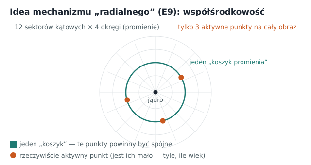
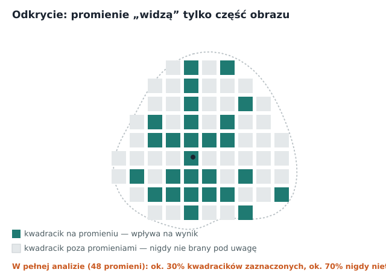
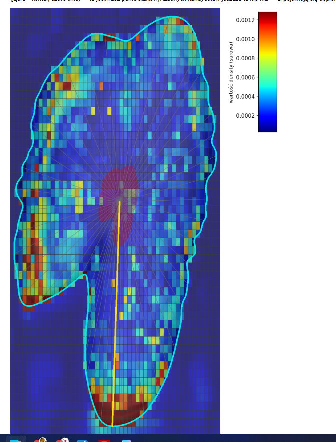
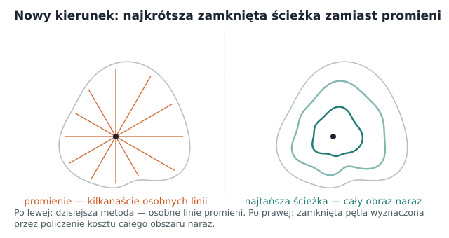
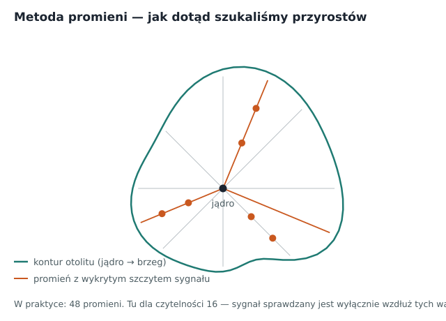

# DINO, podsumowanie procesu: od pierwszego pipeline'u do modelu z uwagą jako podstawą lokalizacji

**Jak jest zbudowany:** projekt rozwijał się dwoma równoległymi wątkami, które się przeplatają:

- **Bieg treningowy (run A, B, C…)** — każdy run to jedno pełne, od zera przetrenowane uruchomienie
  modelu, z własnym configiem i własnymi wynikami (błąd wieku, obciążenie predykcji itd.).
- **metoda lokalizacji (metoda 1, 2, 3…)** — sposób, w jaki z gotowej mapy uwagi modelu wydobywamy konkretne
  pozycje przyrostów. Ta druga ścieżka zmieniała się częściej niż pierwsza i **nie zawsze wymagała nowego
  treningu,** wiele metod testowano na już istniejącym, wytrenowanym modelu.

**To rozróżnienie jest na tyle ważne, że każda sekcja/podsekcja poniżej ma jawny znacznik:**

- **[BEZ TRENINGU — post-hoc]**, działamy na już gotowym, zamrożonym modelu (albo w ogóle bez modelu,
  samą klasyczną obróbką obrazu). Żadna waga sieci się nie zmienia; można to odpalić i sprawdzić w
  minuty, nie w godziny.
- **[TRENING]**, model (albo jego fragment) faktycznie się uczy: wagi sieci są aktualizowane przez
  wiele epok, na serwerze, zwykle godzinami.

Źródła: `outputs/
DINO_proces.md`, cały katalog `plans and summaries/`, oraz kod w `src/`. Liczby, które nie
zostały zmierzone, są oznaczone wprost jako **nie zweryfikowane**.

---

## Spis treści

1. Punkt wyjścia
2. Etap 0: dane i infrastruktura
3. Etap 1: jak model „widzi” i jak się uczy
4. Etap 2: pierwsza lokalizacja: metoda 1 (profil 1D)
5. Etap 3: klasyczna detekcja bez modelu (metoda 2)
6. Etap 4: wiele promieni i pierwsza uczona głowica (metody 3–4, run A)
7. Etap 5: run B: pierwsza próba naprawy lokalizacji — porażka
8. Etap 6: dyscyplina eksperymentu: run C i problem stochastyki
9. Etap 7: run D: odsprzęgnięta głowica gęstości (metoda 5, kierunek B)
10. Etap 8: diagnoza artefaktu i run E: backbone z rejestrami (najlepszy wynik wieku)
11. Etap 9: run F: bramka dojrzałości i konflikt wiek↔lokalizacja
12. Etap 10: metoda 6: naprawa liczenia przyrostów (E1)
13. Etap 11: run G i run H: maskowanie tła, priorytety biologiczne
14. Etap 12: run I: rozdzielczość jako wymiar biologiczny (966px)
15. Etap 13: run J: mechanizm „radialny” (E9), trzy wagi, zerowy efekt
16. Etap 14: metody 8–9: promienie widzą tylko 30% obrazu
17. Etap 15: metoda 10, przegląd literatury i nowy kierunek: najkrótsza zamknięta ścieżka
18. Etap 16: metody 11–17: seria prototypów ścieżki, Frangi, fragmenty łuku
19. Etap 17: dlaczego odchodzimy od promieni
20. Etap 18: nowy kierunek: uwaga modelu jako priorytet
21. Etap 19: run K: wdrożenie zmian A+B+C, wynik: uwaga nie ożywa, wiek nieporównywalny
22. Etap 20: naprawa bramki dojrzałości density + przegląd kodu
23. Etap 21: izolacja zmian A i B: run L (isolate_b) i run M (isolate_a) — macierz zamknięta
24. Etap 22: Zmiana A v2: kodowanie pozycyjne + lokalna uwaga (run N)
25. Etap 23: ZEGAR — pierwsza prawdziwa ewaluacja lokalizacji i odkrycie błędu osi pomiarowej
26. Etap 24: Zmiana B na wierzchu Zmiany A v2 (run `radial_attention_b`) — Zmiana B zbędna
27. Etap 25: dwie tanie diagnostyki (15.08) — artefakt normy wykluczony, trening przekierowany na `window_deg`
28. Etap 26: run `radial_attention_wide_window` — ablacja `density_attn_window_deg` (45°→90°), hipoteza NIEPOTWIERDZONA
29. Etap 27: nowa hipoteza ze strony STRATY — `density_conc_weight`/`density_tv_weight`
30. Etap 28: wynik `radial_attention_smoothness` na ZEGAR — TRZECI negatywny wynik, izolacja stop-gradientu potwierdzona dla architektury
31. Etap 29: wynik `radial_attention_radial_bins` na ZEGAR — CZWARTY negatywny wynik, PIERWSZY wyraźny regres
32. Gdzie jesteśmy teraz — podsumowanie liczbowe
33. Otwarte pytania
34. Bibliografia

---

## 1. Punkt wyjścia, po co to wszystko

Od początku projektu obowiązuje jedno założenie, które determinuje niemal każdą decyzję opisaną niżej:

> **Model ma być asystentem anotacji, a nie automatem zastępującym człowieka.** Nie wystarczy, żeby podał 
> wiek np. „6 lat”, musi też pokazać, gdzie widzi poszczególne przyrosty, żeby dało się to zweryfikować.

Dane: zdjęcia całych otolitów śledzia (HER) w świetle odbitym. Do modelu podajemy **wyłącznie wiek**
każdej ryby — nigdy nie zaznaczamy, gdzie leżą pierścienie. To jest tzw. **słaby nadzór** (*weakly
supervised learning*) i jest źródłem całej trudności części lokalizacyjnej — patrz etap 1.

---

## 2. Etap 0 — dane i infrastruktura **[BEZ TRENINGU]**

Zanim pojawił się jakikolwiek model, trzeba było zbudować rzetelny, nieprzeciekający zbiór danych.

**Źródło:** katalog zdjęć (`Z:/Photo/Otolithes/HER/Processed`) + plik metadanych biologicznych
(Excel). Nazwa pliku koduje strukturę: `{ROK}_{KWARTAŁ}_{GATUNEK}_{LOKALIZACJA}_{TYP}_{POSTPROC}_
FishIndex{N}_Single{N}_{STRONA}.jpg` — ten sam schemat, z którego później (Etap 19) odczytujemy kwartał (półrocze)
połowu (BITS1q, BITS4q, BIAS…).

**Podsumowanie zbioru danych**

| | Zdjęcia na dysku | Z metadanymi (labeled) | Sieroty / bez wieku |
|---|---:|---:|---:|
| Embedded | 9 628 | 7 837 | ~307 sierot + 1 484 wiek nieznany |
| NotEmbedded | 9 099 | 4 924 | 4 175 sierot |
| **Razem** | **18 727** | **12 761** | **~5 966 wykluczone** |

Rozkład wieku: 0–16 lat (17 klas), mediana 4 lata, silnie skośny w stronę młodych roczników, wiek 13 ma
12 próbek, wiek 16 tylko 2. Ta nierównowaga klas wraca jako temat wielokrotnie w dalszych etapach
(systematyczne zaniżanie starych ryb).

**Podział train/val/test (70/15/15) na poziomie RYBY, nie zdjęcia** — kluczowa decyzja projektowa:
identyfikator `neutral_fish_key` łączy oba warianty preparatu (Embedded/NotEmbedded) tej samej ryby, żeby
dwa zdjęcia tego samego osobnika nigdy nie trafiły jednocześnie do treningu i testu (co „przeciekłoby”
odpowiedź). Zweryfikowane: **0 przecieków** na całym zbiorze.

**Projekt pracuje wyłącznie na wariancie Embedded** — NotEmbedded i
porównania krzyżowe nie są rozwijane.

**Zbudowana infrastruktura** (pierwsza wersja pipeline'u): skaner etykiet (`src/scan_labels.py`), loader
danych z kodowaniem wieku (`src/dataset.py`), orkiestrator całego procesu skan→trening→inferencja→karty→
raport (`scripts/run_pipeline.py`), oraz punkt wejścia „jednym kliknięciem” (`main.py` i warianty
`main_*.py` dla kolejnych eksperymentów).

---

## 3. Etap 1 — jak model „widzi” i jak się uczy (fundament) **[BEZ TRENINGU — wyjaśnienie architektury]**

Model zbudowany jest z trzech elementów, które opisane są poniżej.

### 3.1 „Oczy” modelu — DINOv2 (Vision Transformer)

Sercem modelu jest **DINOv2** — sieć typu **Vision Transformer (ViT)**, wstępnie wytrenowana na
milionach zdjęć **bez żadnych etykiet**, metodą samonadzorowaną (sieć uczyła się „widzieć”, porównując
fragmenty obrazów ze sobą). Efekt: uniwersalny ekstraktor cech, dowolny fragment obrazu zamienia na
zestaw liczb opisujący, „co tam widać”. Nie uczymy widzenia od zera, **przenosimy** tę wiedzę na
otolity (*transfer learning*) i lekko **doszlifowujemy** ją na naszych zdjęciach (*fine-tuning*).

Kluczowa różnica względem klasycznych sieci CNN, i powód, dla którego akurat ViT pasuje do pierścieni:

- **CNN** to lupa przesuwana po obrazie: patrzy zawsze na mały wycinek i jego najbliższe sąsiedztwo, a
  rozumienie całości składa warstwa po warstwie. Żeby połączyć dwa odległe fragmenty, potrzebuje wielu
  warstw pośrednich.
- **ViT** tnie obraz na kwadraciki („patche”) i **kładzie je wszystkie na stole naraz**, pozwalając, by
  **każdy kwadracik od razu porównał się z każdym innym** — to mechanizm zwany **uwagą** (*attention*).
  Dzięki temu ViT od pierwszej chwili widzi zależności między odległymi fragmentami.

Na początku założenie było, że pierścień to koncentryczna linia obejmująca **cały** otolit, kwadracik po lewej i po
prawej stronie należą do tego samego pierścienia. ViT łączy je bezpośrednio przez uwagę; CNN musiałby to
budować przez wiele warstw. Konkretnie: zdjęcie 518×518 px dzielimy na siatkę **37×37 = 1369
kwadracików** po 14×14 px, a DINOv2 tworzy dla każdego (i dla całego obrazu) wektor liczb opisujących
zawartość.

Architektura ViT pochodzi z pracy Dosovitskiy i in., *„An Image is Worth 16×16 Words: Transformers for
Image Recognition at Scale”* (ICLR 2021); metoda samonadzorowanego treningu DINO — z Caron i in.,
*„Emerging Properties in Self-Supervised Vision Transformers”* (ICCV 2021), rozwinięta w DINOv2 przez
Oquab i in., *„DINOv2: Learning Robust Visual Features without Supervision”* (2023).

### 3.2 Słaby nadzór, uczymy „gdzie”, mając tylko „ile”

Model dostaje przy każdym zdjęciu **tylko jedną liczbę, wiek** i nigdy nie widzi zaznaczonych
pierścieni. A mimo to ma nauczyć się dwóch rzeczy naraz: **liczyć wiek** i **wskazywać, gdzie są
przyrosty**. Logika jest następująca: jedyny niezawodny sposób, by model stale trafiał w wiek, to żeby
naprawdę znalazł przyrosty. To sprzężenie jest jednak **słabe**, w praktyce model potrafi „oszukiwać”
(zgadywać wiek z ogólnego wyglądu, nie licząc pierścieni). Interakcja pomiędzy „trafnym wiekiem” a „trafną
lokalizacją” jest głównym wątkiem całego dokumentu.

### 3.3 CORAL, liczenie wieku z zachowaniem porządku

Wiek liczony w latach jest zmienną ordynalną, to dyskretny zestaw kategorii (0, 1, 2, …, 16 lat), 
ale kategorie te mają kolejność, i pomyłka o jedną „szufladkę” (4 zamiast 5) powinna kosztować 
mniej niż pomyłka o dziesięć (4 zamiast 14).                                                                         

Zwykła klasyfikacja (jak rozpoznawanie „kot” vs „pies”) traktowałaby „3 lata” i „16 lat” 
jako dwie zupełnie niepowiązane etykiety, pomyłka 3↔4 kosztowałaby tyle samo, co 3↔16. 
Zwykła regresja (jedna liczba) zna odległości, ale nie radzi sobie dobrze z tym, że klasy są dyskretne
i policzalne. Głowica ordynalna (CORAL) jest zaprojektowana specjalnie pod ten pośredni przypadek, 
wprost koduje w swojej konstrukcji ciąg uporządkowanych pytań tak/nie („starszy niż 0?”, „starszy niż 1?”…),
więc z definicji rozumie, że wiek jest uszeregowany, bez zgadywania tego z danych.  

Głowica ordynalna CORAL zamiast zgadywać wiek „od zera”, odpowiada na ciąg uporządkowanych pytań tak/nie: 
„starszy niż 0?”, „starszy niż 1?”, … „starszy niż 15?” (17 klas wieku → 16 progów) i liczy, ile razy 
padło TAK. Konstrukcja matematyczna (rosnące progi odejmowane od jednej wspólnej liczby g) gwarantuje, 
że odpowiedzi nie mogą się wzajemnie przeczyć, tzw. rank-consistency (Cao, Mirjalili, Raschka, 
„Rank consistent ordinal regression for neural networks with application to age estimation”, 
Pattern Recognition Letters, 2020).

CORAL czyta tylko jeden, globalny wektor streszczający cały obraz (token CLS), nie ma wbudowanej lokalizacji. 
Model sam odkrywa, które cechy wizualne korelują z wiekiem. Najpewniej rozmiar otolitu 
(silna korelacja z wiekiem), a także liczbę/rozstaw/kontrast pasm. To rodzi ryzyko „skrótu”: model może 
nauczyć się szacować wiek głównie z rozmiaru, nie licząc pierścieni, dlatego lokalizację trzeba oceniać
i trenować osobno od wieku, co jest tematem większości tego dokumentu.

---

## 4. Etap 2 — pierwsza lokalizacja: metoda 1 (profil 1D)

**[BEZ TRENINGU — post-hoc]** Ważne rozróżnienie: model, którego tu używamy, był już być wcześniej
wytrenowany ( w run A, dalej w tekście), ale to trening **do liczenia wieku**, nie do lokalizacji.
metoda 1 tylko **odczytuje** gotowe cechy tego modelu (normę L2), sama nigdy nie jest niczego uczona pod
kątem „gdzie są przyrosty”. Dlatego przykładowe obrazy niżej pochodzą z już wytrenowanego run A, a mimo
to cała metoda 1 pozostaje „bez treningu”, trenowany był tylko wiek, lokalizacja to tu czysty odczyt.

**Co zostało zrobione:** dla każdego z 1369 patchy wzięliśmy **długość jego wektora cech** (norma L2) jako
prowizoryczną miarę „ważności”, to **heurystyka**, nie sygnał uczony pod lokalizację. Zsegmentowaliśmy
sylwetkę otolitu, znaleźliśmy jądro (centroid) i najdalszy punkt brzegu, odcinek jądro→brzeg to oś
odczytu. Wzdłuż tej jednej osi próbkowaliśmy mapę
ważności (ok. 50 punktów), a lokalne maksima profilu 1D uznawaliśmy za kandydatów na przyrosty.

**Dlaczego tak?:** to metoda prosta, deterministyczna i łatwa do zweryfikowania wizualnie, idealny
punkt startowy, żeby cały pipeline (skan → trening → raport → karta) w ogóle zadziałał.

**Poniżej przykład z run A.** Oba obrazy to nie ilustracje
poglądowe, tylko **zachowane, oryginalne wyjście pipeline'u** z pierwszego dobrego biegu treningowego
(run A, Etap 4), na prawdziwym otolicie ze zbioru testowego:

*Surowa „mapa ważności”, długość wektora cech (norma L2) każdego kwadracika, bez żadnego przetworzenia.
Widać dokładnie, dlaczego to była tylko heurystyka: mapa nie odwzorowuje kształtu otolitu, tylko kilka
osobnych, jasnych plamek w przypadkowych miejscach, „tu coś się dzieje”, a nie „tu jest przyrost”.*

*Ten sam otolit: kontur segmentacji (cyjan), jądro (niebieski krzyżyk), pojedyncza oś odczytu jądro→brzeg
(żółta linia) i wykryte na niej piki (czerwone kropki), w tym konkretnym przypadku 2 kandydatów na 50
próbkowanych punktów wzdłuż osi. Widać gołym okiem główne ograniczenie: oś idzie tylko w dół, więc
pierścienie widoczne w innych częściach otolitu (dobrze widoczne na zdjęciu) są całkowicie poza
zasięgiem metody.*

**Ograniczenia, które wymusiły kolejne kroki:** (1) oś to tylko **jeden promień spośród 360° możliwych
kierunków** (jądro→brzeg w jedną stronę), sprawdza obecność przyrostu w jednym wybranym miejscu jego
obwodu i **całkowicie ignoruje resztę**; skoro (jak pokazują dalsze etapy)
przyrosty bywają dobrze widoczne tylko na części obwodu otolitu, trafienie w akurat ten jeden kierunek
jest loterią.  Przyrost może być świetnie widoczny "tuż obok", a metoda tego nie zobaczy, bo patrzy tylko
w jedną stronę; (2) norma L2 mówi „tu coś jest”, a nie „tu jest przyrost”; (3) gdy segmentacja zawodzi,
pipeline spada do prymitywnej pionowej linii przez środek.

---

## 5. Etap 3 — klasyczna detekcja bez modelu (metoda 2)

[BEZ TRENINGU] W tym podejściu nie wykorzystuje się modelu uczenia maszynowego. Detekcja opiera się wyłącznie
na klasycznych metodach przetwarzania obrazu, takich jak progowanie, poprawa kontrastu i transformacje geometryczne.

Ponieważ na zdjęciach otolitów widoczne są naprzemienne jaśniejsze i ciemniejsze pasma, sprawdzono, 
czy możliwe jest ich wykrywanie bezpośrednio na podstawie zmian jasności obrazu. 
Przetestowano trzy podejścia:
uśrednianie jasności wzdłuż skalowanych konturów otolitu,
analizę profilu intensywności po wcześniejszym zwiększeniu lokalnego kontrastu metodą CLAHE,
transformację polarną względem jądra otolitu, która zamienia pierścienie na przebieg zbliżony do poziomych pasm,
a następnie uśrednianie sygnału po kątach.

Uzyskany wynik był negatywny. Dla wariantu Embedded wykrywano zwykle tylko 0–2 pierścienie, 
czyli zdecydowanie za mało. W wariancie NotEmbedded liczba detekcji wzrastała do 14–15, 
jednak większość stanowiły fałszywe wskazania związane głównie z nieregularnym brzegiem otolitu. 
Transformacja polarna również nie ujawniła wyraźnego, powtarzalnego sygnału odpowiadającego kolejnym 
pierścieniom. Zamiast tego uzyskiwano przede wszystkim łagodny przebieg zmian jasności.

Na tej podstawie uznano, że w zdjęciach całych otolitów wykonanych w świetle odbitym sygnał związany z 
pierścieniami jest zbyt słaby i zbyt zmienny, aby klasyczne metody przetwarzania obrazu mogły zapewnić 
wiarygodną detekcję.

Podjęto decyzję o skoncentrowaniu dalszych prac na podejściu modelowym. Założono, że model powinien nauczyć się 
rozpoznawania struktur związanych z wiekiem bez konieczności ich wcześniejszego definiowania za pomocą sztywnych 
reguł przetwarzania obrazu. Klasyczne algorytmy pozostawiono w projekcie jako narzędzia diagnostyczne i punkt 
odniesienia dla wyników modelu (por. Etap 16), jednak nie są już rozwijane jako główna metoda detekcji.

---

## 6. Etap 4 — wiele promieni i pierwsza uczona głowica (Metody 3–4, run A)

### metoda 3 — od jednej osi do wielu promieni **[BEZ TRENINGU]**

Skoro pierścień, w teorii można znaleźć na całym obwodzie otoliry, jedna oś to za mało. Zamiast jednego odcinka, zaczęliśmy rzucać **48
promieni** z jądra we wszystkich kierunkach, na każdym szukać piku mapy, a potem **grupować piki o
podobnej odległości od jądra** w jeden pierścień. Punkty z wielu kierunków łączą się w zamkniętą
krzywą podążającą za realnym kształtem otolitu. Wprowadziliśmy też marginesy (nie liczymy pików tuż przy
jądrze ani tuż przy krawędzi preparatu) oraz regułę wyboru: spośród wszystkich wykrytych pierścieni
bierzemy dokładnie tyle najsilniejszych, ile wynosi przewidziany wiek.

To był realny postęp geometryczny (stabilniejsze pozycje z konsensusu wielu kierunków), ale wciąż
opierał się na tej samej heurystycznej mapie L2 z Etapu 2 — nie na sygnale uczonym pod lokalizację.

*48 promieni rzuconych z jądra na otolicie (po prawej) i ten sam zestaw
pików na wykresie biegunowym (po lewej) — kolor kropki koduje siłę sygnału w danym punkcie. Widać od
razu przewagę nad Metodą 1: teraz każdy fragment obwodu ma swój własny promień, nie tylko jeden.*

### metoda 4 — MIL, pierwsza *uczona* głowica lokalizacji **[TRENING]**

Tu następuje jakościowy skok — pierwszy moment w całym procesie, gdzie lokalizacja przestaje być
gotowym, niewyuczonym odczytem (Metody 1–3) i staje się czymś, czego model **faktycznie się uczy**.
Zamiast heurystyki L2, wprowadziliśmy uczoną głowicę — **MIL** (*Multiple Instance Learning*). Mały
wspólny klasyfikator ocenia **każdy z 1369 kwadracików osobno** i zwraca prawdopodobieństwo, że ten
konkretny kwadracik leży na przyroście. Prawdopodobieństwo to jest **wynikiem treningu** (wagi tego
klasyfikatora są dopasowywane przez wiele epok), nie gotowym odczytem z pretrenowanej sieci. Sam
faktyczny trening (ile epok, jaki błąd wieku) opisuje **run A** poniżej — MIL i CORAL trenują się w nim
razem, jednocześnie.

Podstawowy pomysł „suma prawdopodobieństw = wiek” **zawiódł**: przy średnim wieku ~3,8 i 1369
kwadracikach ten warunek spełnia się już przy ~0,3% prawdopodobieństwa na każdym z nich — sieć
rzeczywiście to osiągała, rozmazując sygnał równomiernie po całym obrazie, bez żadnego wyraźnego
„zapalenia” (na mapie nic nie widać). Zamiast tego wprowadziliśmy cel treningowy **top-k
concentration**: przy każdym kroku uczenia bierzemy `⌈wiek⌉` kwadracików o aktualnie najwyższym
prawdopodobieństwie i każemy im dążyć do 1, a wszystkim pozostałym — do 0.

To jest jednak cel treningu, nie twarda gwarancja na wyjściu z sieci: mapa faktycznie zyskała
wyraźne „zapalenia” zamiast mgły, ale liczba aktywnych kwadracików (próg >0,5) nie trafia w wiek
dokładnie.

**Trwałe ograniczenie:** MIL było niedokładnym licznikiem przyrostów — na naszych danych zapalało
zwykle ~9–10 kwadracików, podczas gdy średni wiek w zbiorze wynosił ~3,8, czyli systematycznie
zawyżało liczbę wykrytych przyrostów. Dodatkowo mapa aktywacji częściej tworzyła jedną rozmytą
plamę niż serię oddzielnych, wyraźnie rozdzielonych pierścieni.
<<< POPRAWIONE >>>
### run A, baseline (CORAL + MIL) **[TRENING]**

Pierwszy pełny, stabilny bieg treningowy łączący CORAL (wiek) i MIL (lokalizacja).

| |                                                                                              |
|---|----------------------------------------------------------------------------------------------|
| **Config** | `configs/config.yaml` — CORAL+MIL, backbone `dinov2_vits14`, 518px, 50 epok (early stop @37) |
| **Wynik** | MAE wieku **0,789**, Bias −0,039, trafienia ±1 rok ~85%                                      |
| **Wniosek** | Punkt odniesienia dla „ile lat”. Wszystkie kolejne zmiany oceniamy względem tego wyniku.     |

---

## 7. Etap 5 — run B: pierwsza próba naprawy lokalizacji — porażka **[TRENING]**

MIL zapalał jedną plamę zamiast oddzielnych pierścieni. Żeby wymusić rozdzielenie, dołożyliśmy do straty
MIL dodatkowy człon — **radial-spread**: karę „rozpychającą” aktywne kwadraciki wzdłuż promienia od
jądra, z docelową rozpiętością rosnącą z wiekiem.

| | |
|---|---|
| **Config** | jak run A + `mil_radial_spread_loss` (cel wariancji promieniowej `0,10 + 0,03·wiek`) |
| **Wynik** | MAE wieku **0,838** (gorzej niż A), Bias −0,14 (silniejsze zaniżanie), wczesne zatrzymanie **37→17 epok**, mapy uwagi rozmyte/bez sensu |
| **Wniosek** | **Porażka.** Dwa powody: (1) cel „rozpychania” był sztuczny — heurystyka narzucona z góry, niezwiązana z realnym położeniem przyrostów; (2) gradient tej kary płynął do **współdzielonego backbone'u** i psuł cechy, na których opiera się głowica wieku. |

> **Wniosek: lokalizacji NIE WOLNO sprzęgać z backbonem głowicy
> wieku.** Poprawianie „gdzie” nie może odbywać się kosztem „ile”. Każda kolejna próba musi być
> **odsprzęgnięta** od cech napędzających wiek. Radial-spread usunięto w całości.

---

## 8. Etap 6 — dyscyplina eksperymentu: run C i problem stochastyki **[TRENING]**

Po usunięciu radial-spread uruchomiono bieg z **dokładnie tą samą recepturą co run A**.

| | |
|---|---|
| **Config** | identyczny z run A (radial-spread usunięty z kodu) |
| **Wynik** | MAE wieku **0,853** — GORZEJ niż run A (0,789), mimo identycznej recepty i identycznego (bajt w bajt) podziału danych |
| **Wniosek** | Różnica ma źródło w **stochastyce treningu**, nie w kodzie ani w danych. |

To odkrycie zasługuje na osobne wyjaśnienie, bo podważało wiarygodność WSZYSTKICH dotychczasowych
porównań. Dowód krok po kroku:

1. **Kod identyczny** — `git diff` między wersjami pokazał zero zmian w matematyce treningu.
2. **Podział danych identyczny** — porównanie zbiorów testowych: przecięcie 1131/1131 obrazów, zero
   różnic.
3. **Krzywe walidacyjnego błędu (val_MAE) obu biegów oscylują w tym samym paśmie** (~0,81–1,0) po
   odmrożeniu backbone'u — różnica sprowadza się do tego, **który dołek szumu bieg akurat złapał**: dobry
   bieg trafił dołek 0,792 w epoce 27 (co zresetowało licznik cierpliwości i pozwoliło trenować dalej),
   gorszy bieg miał najlepszy dołek 0,837 w epoce 18 i zatrzymał się w epoce 28.

Ponieważ zapisywany model to ten z epoki o **najniższym** chwilowym błędzie walidacyjnym, **jakość
finalnego modelu = jakość „najszczęśliwszej” epoki**. Dwa identyczne treningi mogą wylądować na 0,79 vs
0,85 wyłącznie przez losowość (kolejność danych, losowe wyłączanie neuronów w dropout) — bez kontroli tej
losowości nie da się uczciwie porównywać żadnych dwóch receptur.

**Naprawa (obowiązuje od tego momentu w całym projekcie):**
1. **Seedowanie** — ustalone ziarno losowości, więc ten sam trening daje ten sam wynik.
2. **Wygładzony (EMA) wybór modelu** — zamiast wybierać checkpoint po surowym, „skaczącym” błędzie
   walidacyjnym, uśredniamy go w czasie i wybieramy po wersji wygładzonej — koniec loterii pojedynczej
   szczęśliwej epoki.

Dodatkowo zdiagnozowano **efekt maskowany przez zagregowane obciążenie (Bias)**: pozornie „ładne”
Bias ≈ −0,04 dobrego biegu było w dużej mierze artefaktem kasowania się dodatniego obciążenia na młodych
rybach z ujemnym na starych — **oba** biegi strukturalnie zaniżały rzadkie, stare roczniki (wiek 8+:
błąd od −0,7 do −5,0 roku). To realne, uporczywe ograniczenie wynikające z nierównowagi klas (Etap 0), a
nie błąd konkretnego biegu.

---

## 9. Etap 7 — run D: odsprzęgnięta głowica gęstości (metoda 5, Kierunek B) **[TRENING]**

Lekcja z run B (Etap 5) wymuszała nowe podejście: lokalizacja musi być **architektonicznie** odseparowana
od backbone'u wieku, nie tylko „ostrożnie” trenowana.

### Skąd pomysł — analogia z liczenia tłumu

Najbliższym znanym problemem w literaturze jest **liczenie tłumu z obrazu** (*crowd counting*): sieć
tworzy mapę gęstości, której **całka ≈ liczba obiektów**, a **piki = pozycje obiektów**. To dokładnie
nasz problem — policz i zlokalizuj, mając tylko liczbę. Kluczowe źródła: Wan i Chan, *„A Generalized Loss
Function for Crowd Counting and Localization”* (CVPR 2021); *„Towards using count-level weak supervision
for crowd counting”* (Pattern Recognition, 2020); Lin i in., *„Optimal Transport Minimization: Crowd
Localization on Density Maps for Semi-Supervised Counting”* (CVPR 2023).

### Mechanizm

1. **Stop-gradient** — nowa głowica gęstości czyta te same cechy kwadracików co reszta modelu, ale przez
   mechanizm zwany *stop-gradient*: jej uczenie **nie sięga wstecz do backbone'u**. Obrazowo: głowica
   gęstości „ogląda” cudzy pokój przez okno, ale nic z tego pokoju nie może zmienić. Dzięki temu,
   cokolwiek stanie się z lokalizacją, **głowica wieku CORAL jest bezpieczna z definicji** — powtórka
   porażki z run B jest niemożliwa konstrukcyjnie. (Potwierdza to test jednostkowy: strata gęstości daje
   zerowy gradient do backbone'u — sprawdzane automatycznie od tego momentu przy każdej zmianie.)
2. **Count-consistency** — mapa gęstości uczona jest dwoma członami naraz (bo samo „całka = wiek”
   zawodzi tak samo, jak zawodziło w MIL): **spójność liczby** (całka z mapy ≈ wiek) i **koncentracja**
   (`⌈wiek⌉` najsilniejszych komórek → do 1, reszta → do 0, żeby powstały policzalne piki, a nie mgła).

| | |
|---|---|
| **Config** | CORAL+MIL nietknięte + nowa głowica density (stop-gradient), `density_count_weight=1.0`, `density_conc_weight=1.0` |
| **Wynik** | MAE wieku **0,807** (dobre); liczba aktywnych komórek gęstości bliżej prawdy niż MIL, ALE świeciła głównie na krawędziach/refleksach światła, nie na pierścieniach |
| **Wniosek** | Wiek bezpieczny, mechanizm licznikowy lepszy niż MIL — ale lokalizacja wciąż nietrafna. Wymaga diagnozy (Etap 8). |

---

## 10. Etap 8 — diagnoza artefaktu i run E: backbone z rejestrami (najlepszy wynik wieku)

Ten etap ma dwie różne części: **diagnoza** poniżej to analiza już gotowych map z run D **[BEZ
TRENINGU]** — nic tu się nie uczy, tylko sprawdzamy, dlaczego wynik wygląda jak wygląda. Dopiero **run E**
niżej to nowy, faktyczny trening **[TRENING]**, który z tej diagnozy wynika.

Na kartach było widać, że gorące punkty mapy gęstości siedzą **na rancie otolitu**, a nie na
pierścieniach wewnątrz. Sprawdzono to empirycznie: to nie błąd rysowania ani maski (kontur idealnie
obrysowuje otolit). To **artefakt samego backbone'u**: w DINOv2 garstka kwadracików ma anomalnie wysoką
„normę” cech (tzw. *register tokens*) i zapala się na refleksach światła, pęcherzykach powietrza i
granicy otolit↔tło — czyli na najbardziej kontrastowych miejscach, którymi akurat są krawędzie. Norma
najgorszych kwadracików bywała **tysiące razy** wyższa od typowej. Zjawisko opisane w: Darcet, Oquab,
Mairal, Bojanowski, *„Vision Transformers Need Registers”*, ICLR 2024.

**Decyzja:** przejście na wariant backbone'u „z rejestrami” (`dinov2_vits14_reg`) — rejestry dają sieci
osobne „kieszonki” na globalne informacje, więc przestaje ona zaśmiecać kwadraciki obrazu wysoką normą.

### run E — backbone z rejestrami + prior spójności (TV) **[TRENING]**

Równolegle włączono łagodny prior **total-variation** (TV): zachęca sąsiednie kwadraciki mapy gęstości,
by miały podobne wartości, żeby zamiast rozproszonych ziaren powstawały spójne, policzalne plamy.

| | |
|---|---|
| **Config** | jak run D + `backbone: dinov2_vits14_reg` + `density_tv_weight=0.1` |
| **Wynik** | MAE wieku **0,751 — najlepszy wynik wieku w całym projekcie**, trafienia ±1 rok **87,5%**, systematyczne zaniżanie starych ryb spadło czterokrotnie. ALE: głowica gęstości była martwa przez 22 z 26 epok treningu — obudziła się dopiero w ostatnich czterech |
| **Wniosek** | Rejestry robią z DINOv2 lepsze „oczy” — i to widać na wieku, nie tylko w mapach. Ale „najlepszy” checkpoint zapisywany po błędzie wieku zamroził model, gdy lokalizacja jeszcze spała — test lokalizacji na tym biegu jest nierozstrzygający. |

---

## 11. Etap 9 — run F: bramka dojrzałości i konflikt wiek↔lokalizacja **[TRENING]**

Zanim uruchomiono kolejny bieg, wprowadzono dwie poprawki: (1) wyłączono TV (żeby sprawdzić, czy to ono
usypiało gęstość), (2) dodano **bramkę dojrzałości gęstości** — mechanizm, który nie pozwala zamrozić
„najlepszego modelu”, dopóki głowica gęstości nie ożyje.

| | |
|---|---|
| **Config** | jak run E + `density_tv_weight=0`, bramka `min_density_active=1.0` |
| **Wynik** | MAE wieku **0,800** (regresja z 0,751); bramka gęstości **zadziałała** — trening trzymał się do dojrzałości lokalizacji (~24 dodatkowe epoki); ALE gęstość obudziła się **tak samo późno** mimo wyłączonego TV — hipoteza o TV **obalona** |
| **Wniosek** | Odkryto strukturalny problem: **wiek i lokalizacja chcą różnych checkpointów.** Wiek jest najlepszy wcześnie (backbone jeszcze się nie przeuczył), gęstość dojrzewa dopiero później. Wymuszając „dojrzały” checkpoint, bramka wybrała epokę, w której wiek już lekko podryfował. Rozwiązanie na przyszłość: dwa osobne checkpointy (wiek / lokalizacja). |

---

## 12. Etap 10 — metoda 6: naprawa liczenia przyrostów (E1) **[BEZ TRENINGU]**

To była zmiana **wyłącznie w obróbce wyników po treningu** (post-hoc), nie w samym modelu — ale
najważniejsza pojedyncza naprawa w historii lokalizacji.

**Problem:** przy grupowaniu pików z 48 promieni w „pierścienie” używaliśmy zachłannego łączenia:
„dołączaj kolejny pik, jeśli jest blisko poprzedniego”. Przy gęstych pikach (klasyka daje ich setki, tuż
obok siebie) to zlepiało się w jeden–dwa wielkie klastry — dla ryby 8-letniej model wskazywał… 1 przyrost.

**Naprawa:** zamiana na szukanie skupień w **rozkładzie promieni** (gdzie naprawdę zbiega się wiele
kierunków), z wymuszonym minimalnym rozstawem.

**Efekt:** liczba wykrytych przyrostów przestała się zapadać i zaczęła zgadzać z wiekiem — dla ryby
8-letniej osiem pozycji, dla 3-letniej trzy. To była przyczyna, dla której wcześniejsze biegi „wyglądały
na nie liczące” — wina leżała w obróbce, nie w modelu. (Trafność samych *pozycji* to osobna sprawa —
patrz dalej).

**metoda 7 — dopracowanie: klastry jako łuki, nie tylko punkty. [BEZ TRENINGU]** Kolejnym krokiem było uznanie, że
przyrosty rzadko są widoczne na całym obwodzie otolitu naraz — bywają wyraźne tylko na fragmencie
(np. jedna ćwiartka), a gdzie indziej ledwo widoczne. Zamiast nagradzać poparcie rozproszone po całym
obwodzie, klastrowanie zaczęło premiować pierścień widoczny wzdłuż **spójnego, mocnego łuku**.

*Prawdziwy przykład: po lewej wykres biegunowy z kandydującymi klastrami (kolorowe pasy), po prawej ten
sam otolit — czerwony owal zaznacza jeden, konkretny, wygrany klaster wybrany właśnie dlatego, że jego
promienie (żółte) tworzą ciągły, sąsiadujący łuk, a nie rozrzucone po całym obwodzie pojedyncze trafienia
(szare).*

---

## 13. Etap 11 — run G i run H: maskowanie tła, priorytety biologiczne **[TRENING]**

Sprawdzono fakt, który dotąd umykał: model dostaje **całe zdjęcie** (ściśnięte do kwadratu), a nie sam
otolit — maska służyła dotąd tylko do rysowania nakładek. Nowa metryka pokazała, że **~12–17% „uwagi”
modelu pada poza otolit** — na tło i krawędź preparatu.

### run G — maskowanie tła + bramka + dwa checkpointy

| | |
|---|---|
| **Config** | jak run F + `data.mask_background=true` (tło → stały kolor = średnia ImageNet, nie czerń — czarne tło dawałoby ostrą krawędź dokładnie tam, gdzie artefakt rejestrów już wcześniej sprawiał kłopoty) + osobny checkpoint `best_age.pt` |
| **Wynik** | MAE wieku **0,7993**, Bias **+0,058** (pierwszy dodatni bias w projekcie), trafienia ±1 rok **85,15%**; gęstość obudziła się już w epoce 10 (nie 23) |
| **Wniosek** | Maskowanie tła realnie przyspiesza „budzenie się” lokalizacji — potwierdzone też w run H poniżej. Konflikt wiek↔gęstość z Etapu 9 zniknął (oba checkpointy wylądowały na tej samej epoce). |

### run H — LayerNorm/LR/TV w głowicy density + wyższa rozdzielczość density + biologiczny margines jądra

Trzy tanie, niskoryzykowne zmiany dotyczące wyłącznie głowicy density (więc z definicji nie mogły
pogorszyć wieku): normalizacja wejścia głowicy (LayerNorm), własny, wyższy mnożnik szybkości uczenia dla
głowicy density, i ponowne włączenie (małego) priorytetu spójności TV. Dodatkowo: wyższa rozdzielczość
**tylko przy wykrywaniu kandydatów** (728px zamiast 518px, bez zmian w treningu wieku) oraz podniesienie
strefy wykluczenia wokół jądra z 0,05 do 0,20 promienia — po przeglądzie literatury rybackiej (ICES/
BHARSG — Baltic Herring Age Reading Workshop), gdzie mylenie pierwszego prawdziwego pierścienia z
fałszywym „checkiem” blisko jądra jest udokumentowanym, znanym problemem nawet dla doświadczonych
czytających.

| | |
|---|---|
| **Config** | jak run G + LayerNorm w density_head + `density_lr_mult=2.0` + `density_tv_weight=0.03` + `candidates.inner_margin=0.20` |
| **Wynik** | MAE wieku **0,7993 — bit-identyczne z run G, epoka po epoce** (pierwszy bezpośredni, produkcyjny dowód, że architektura głowicy density nie ma ŻADNEGO wpływu na wiek); lokalizacja: skromna, mieszana poprawa (−4,7% w metodzie produkcyjnej) |
| **Wniosek** | Dowód izolacji stop-gradientu działa dokładnie tak, jak zaprojektowano (Etap 7). `inner_margin=0,20` jest jawnie oznaczony jako **niezweryfikowany punkt startowy dla śledzia bałtyckiego** (ekstrapolacja z gatunków pokrewnych: 0,15–0,30), nie zmierzona wartość. |

---

## 14. Etap 12 — run I: rozdzielczość jako wymiar biologiczny (966px) **[TRENING]**

Rozdzielczość obrazu do tej pory była traktowana jako parametr techniczny. Zauważono, że to też pytanie
**domenowe**: przyrosty roczne to *detal* na obrazie, a rozdzielczość wprost określa, ile tego detalu
model w ogóle może zobaczyć. Zmierzono natywne rozmiary zdjęć (próbka 300 z 19 858): mediana
`max(szerokość, wysokość)` to **1230 px** — powyżej tego pułapu dla większości zdjęć tylko upscalujemy
już istniejące piksele, nie dodajemy realnego detalu.

| | |
|---|---|
| **Config** | jak run H, ale `data.image_size=966` (69×69=4761 patchy, 3,5× więcej niż 518px), CORAL+MIL+density trenowane RAZEM na tej rozdzielczości od epoki 1 — pierwsza zmiana świadomie dotykająca wejścia CORAL |
| **Koszt** | ~67,5 godziny ściany (2 dni 19 h 33 min) — najdroższy pojedynczy bieg w projekcie |
| **Wynik** | MAE wieku **0,8240 — pogorszenie o 3,1%**, obciążenie zmieniło znak (−0,136); lokalizacja: brak wyraźnej poprawy po kontroli o skład próby |
| **Wniosek** | Prawdopodobna przyczyna: DINOv2 był pretrenowany na niższej rozdzielczości natywnej niż 966px, a interpolacja siatki pozycyjnej jest coraz mocniej ekstrapolowana poza wyuczony reżim. **Zamknięto dalsze ciąganie drabiny rozdzielczości** (1232px i wyżej) — koszt rósłby dalej bez wyraźnego zysku. Wizualne porównanie potwierdziło: wyższa rozdzielczość robi mapę gęstości bardziej ROZPROSZONĄ, nie bardziej pierścieniową. |

---

## 15. Etap 13 — run J: mechanizm „radialny” (E9) — trzy wagi, zerowy efekt **[TRENING]**

Cała diagnostyka do tej pory (Etapy 8–12) wskazywała na wspólny korzeń: głowica density uczy się
wyłącznie z policzalności (suma≈wiek + koncentracja), bez żadnego pojęcia geometrii — nie wie, że
prawdziwy roczny pierścień to **krzywa o w przybliżeniu stałym promieniu** wokół jądra, taka sama we
wszystkich kierunkach.

### Idea

Analogia: rzuć kamień do wody — fale rozchodzą się jako coraz szersze **okręgi** wokół jednego punktu.
Każda fala jest w tej samej odległości od środka, niezależnie z której strony patrzysz. Roczne przyrosty
rosną tak samo — wokół jądra. Dodaliśmy nowy, niezależny człon straty: `density(r,θ) ≈ density(r)` — przy
ustalonym promieniu `r`, wartość gęstości powinna być podobna niezależnie od kąta `θ`. Liczony na
stop-gradiencie, jak reszta głowicy density — zero ryzyka dla wieku z tych samych powodów co w Etapie 7.

*Punkty leżące w tej samej odległości od jądra (ten sam kolorowy okrąg — „koszyk promienia”) powinny
„mówić to samo”. W praktyce aktywnych punktów jest tak mało (średnio 3–4 na cały obraz — tyle, ile wynosi
wiek), że w większości koszyków nie ma czego ze sobą porównywać. To właśnie okazało się przyczyną
porażki poniżej.*

### Wynik — testowano trzy siły tej „podpowiedzi” (wagi różniące się stukrotnie)

| Waga | MAE wieku | Efekt lokalizacyjny (metoda produkcyjna, mean_dist) |
|---|---:|---|
| 0,1 | 0,7993 (bit-identyczne z run H) | 228,6 → 229,2 px (+0,24%, szum pomiaru) |
| 1,0 | 0,7993 (bit-identyczne) | 229,2 px — **0/30 kart zmieniło wynik względem wagi 0,1** |
| 10,0 | 0,7993 (bit-identyczne) | 229,2 px — tylko 4/30 kart się zmieniło, jedyna realna zmiana poszła w **złą** stronę |

**Bezpieczeństwo: pełny sukces** — wiek identyczny do czwartego miejsca po przecinku na wszystkich trzech
wagach, mimo stukrotnego rozstępu.

**Skuteczność: zerowa.** Przyczynę znaleziono w kodzie, nie zgadywano: model uczony jest, żeby zaznaczać
bardzo niewiele miejsc na całym obrazie (tyle, ile wynosi wiek, z ~1369 możliwych). Przy 12 „koszykach”
promienia i tylko ~3–4 aktywnych kwadracikach, typowy koszyk nie ma **żadnego** aktywnego kwadracika —
wariancja garstki wartości bliskich zeru jest z definicji bliska zeru. Nawet w szczycie treningu, nawet
przy 100-krotnie wyższej wadze, wkład tej kary do całkowitej straty to **~0,25%** — trzy rzędy wielkości
za mało, żeby cokolwiek realnie zmienić. Żeby to naprawić, trzeba by wagi rzędu 1000–10 000, co
ryzykowałoby destabilizację całej głowicy.

**Wniosek:** to trzeci, uczciwie zmierzony negatywny wynik w obszarze lokalizacji — wartościowy, bo
zawęża pole poszukiwań, nawet jeśli sam pomysł (podpowiedzieć modelowi geometrię wprost) brzmiał dobrze.
Formalnie zamknięte w tej postaci.

---

## 16. Etap 14 — Metody 8–9: promienie widzą tylko 30% obrazu **[BEZ TRENINGU]**

Punktem wyjścia był prosty, wizualny wniosek: skoro wykrywanie kandydatów opiera się na 48 promieniach
próbkowanych po 64 punkty, **ile w ogóle kwadracików z całej siatki density te promienie kiedykolwiek
dotykają?**

*Ten sam otolit jako siatka kwadracików mapy density. Zaznaczone są tylko te leżące na którymś z
promieni — reszta nigdy nie ma szansy wpłynąć na wynik, z samej konstrukcji metody.*

**metoda 8 — pomiar:** zbudowany raport pokazał wprost, na tym samym otolicie, w dwóch rozdzielczościach
modelu: **tylko 29–37% kwadracików kiedykolwiek wchodzi** do jakiegokolwiek sygnału wykorzystywanego
przez wykrywanie kandydatów. Ponad 60% obrazu nigdy nie ma szansy wpłynąć na wynik.

*Prawdziwa mapa density modelu na realnym otolicie, z jednym promieniem podświetlonym na żółto i
zaznaczonym różowym „stożkiem” najbliższego sąsiedztwa. Widać wprost, ile kolorowych kwadracików mapy
leży poza jakimkolwiek promieniem — cała reszta siatki (poza wąskimi żółtymi/różowymi pasami) nigdy nie
trafia do wykrywania kandydatów.*

**metoda 9 — próba naprawy (agregacja sektorowa):** zamiast próbkować dosłowną linię, każdy kwadracik w
masce dostaje własny sektor kątowy i własny promień; profil każdego z 48 sektorów budowany jest przez
wzięcie MAKSIMUM ze wszystkich kwadracików trafiających w dany koszyk. Pokrycie skoczyło z ~30–37% do
~62% — czyli **dokładnie 100% teoretycznego maksimum** (reszta obszaru to tło, które i tak nie powinno
się liczyć).

| | |
|---|---|
| **Walidacja** | Rzetelny test na 30 kartach (ta sama próba co wszystkie poprzednie porównania) |
| **Wynik** | `mean_dist` do referencji klasycznej pogorszył się o **15%** (260,71→299,67 px), 100% kart zmieniło swój finalny wybór pozycji |
| **Wniosek** | **Regresja, nie poprawa** — odrzucone. Więcej pokrycia wciągnęło więcej szumu (prawdopodobnie więcej szans trafienia w znany artefakt brzegowy w każdym z 48 kierunków osobno), nie więcej sygnału. Trzeci uczciwie udokumentowany negatywny wynik w tym obszarze (obok run B i run J) — cenny, bo zawęża przestrzeń poszukiwań. |

---

## 17. Etap 15 — metoda 10, przegląd literatury i nowy kierunek: najkrótsza zamknięta ścieżka **[BEZ TRENINGU]**

Po dwóch negatywnych próbach naprawy metody promieniowej (run J, metoda 9) przejrzano literaturę pod
kątem dokładnie tego problemu: wykrywanie K współśrodkowych, częściowo widocznych pierścieni na obrazie
2D, bez odrzucania większości sygnału i bez niezależnych, podatnych na szum decyzji per-kierunek.

**Diagnoza wspólnej wady obu wypróbowanych dotąd metod:** obie (1) tną obwód na niezależne kierunki, (2)
w każdym kierunku osobno decydują „czy tu jest pik”, (3) dopiero potem sklejają te niezależne decyzje w
spójny pierścień. Szukano więc metody, która używa **całego** sygnału 2D i wymusza ciągłość pierścienia
**jako część samej optymalizacji**, a nie jako osobny krok po fakcie.

**Znalezione rodziny metod** (z pełnymi odnośnikami w Bibliografii, poz. 9–16):

- **Circular / closed shortest-path** — globalnie optymalna, zamknięta ścieżka na obrazie 2D, z natywną
  obsługą zawinięcia 0°/360°. Blisko spokrewniona z **graph-based optimal multi-surface segmentation**
  (Li i in. 2006), szeroko stosowaną w segmentacji warstw siatkówki oka w obrazowaniu medycznym (OCT).
- **Rodin & Troadec (1997)** — *„Growth ring detection on fish otoliths by a graph construction”* —
  rekonstrukcja 2D pierścieni przez odtworzenie łączności węzłów wykrytych w układzie biegunowym; ten
  sam zespół — deformowalny zamknięty B-spline jako szablon konturu, „nadmuchiwany” od jądra na
  zewnątrz. Udokumentowana słabość: dobre wyniki tylko do ok. 3 roku życia.
- **CS-TRD / DeepCS-TRD (2023–2025)** — nowoczesny, aktywnie rozwijany odpowiednik dla słojów drzew:
  rzuca promienie, wykrywa krawędzie, a potem łączy łańcuchy krawędzi z różnych promieni w jeden
  pierścień metodą „spider web” (F-score 89–97% na publicznych zbiorach).
- **Filtr Frangiego (ridge/vesselness)** — zamiast próbkować promienie, liczy „jak bardzo to wygląda na
  fragment krzywej” w KAŻDYM pikselu z lokalnego sąsiedztwa (analiza wartości własnych macierzy Hessego);
  historyczne źródło: segmentacja naczyń krwionośnych w obrazowaniu medycznym.
- **Głęboka, gęsta segmentacja granic (U-Net/Mask R-CNN)** — dojrzały standard domenowy dla otolitów,
  ale wymaga ręcznie zaanotowanych granic pierścieni, których ten projekt **nie ma** — świadomie odłożone
  jako inny rząd zmiany (patrz Etap 18).

**Decyzja:** najsilniejszy kandydat do wypróbowania — **najkrótsza zamknięta ścieżka**, jedyna metoda
naprawiająca oba znalezione problemy naraz (utratę informacji i podatność na szum), całkowicie post-hoc
(żadnego treningu, kod produkcyjny nietknięty na etapie prototypu).

*Po lewej: dzisiejsza metoda — kilkanaście osobnych linii. Po prawej: nowe podejście — zamknięta pętla
wyznaczona przez policzenie kosztu całego obszaru naraz, bez podziału na linie. Gładkość pierścienia
wynika wprost z matematyki szukania najtańszej trasy — analogicznie do wyznaczania najkrótszej drogi
dookoła jeziora na mapie terenu, licząc koszt każdego fragmentu terenu, a nie tylko kilkudziesięciu z
góry wybranych ścieżek.*

---

## 18. Etap 16 — Metody 11–17: seria prototypów ścieżki, Frangi, fragmenty łuku **[BEZ TRENINGU]**

Wszystkie poniższe eksperymenty są **post-hoc** — działają na już wytrenowanym modelu (run H), bez
żadnego nowego treningu, w osobnym skrypcie diagnostycznym, nie w kodzie produkcyjnym.

**metoda 11 — mechanizm działa, dobór sygnału decyduje.** Zbudowano graf: węzeł = (kolumna kątowa,
promień) w siatce biegunowej; krawędzie łączą sąsiednie kolumny kątowe, z karą za skok promienia
(wymusza gładkość), rozwiązywany jako cykliczna najkrótsza ścieżka. Testowano trzy niezależne pola
„kosztu” przez ten sam mechanizm graf+DP:

| Pole kosztu | Wynik |
|---|---|
| mapa density modelu | zdegenerowane — pierścienie zlepiają się przy dozwolonej krawędzi (pole jest prawie puste, spójne z odkryciem z run J) |
| surowa jasność zdjęcia | zły dobór — pierścienie zwijają się wokół najjaśniejszego miejsca, nie granic |
| gradient promieniowy (bez nowych zależności) | sensowne, rozłożone pierścienie |

**Wniosek Metody 11:** sam mechanizm (graf + programowanie dynamiczne, zamknięta pętla) działa poprawnie
— problem leży wyłącznie w doborze sygnału, nie w metodzie.

**metoda 12 — prawdziwy filtr Frangiego + fragmenty otwarte.** Po instalacji `skimage.filters.frangi`:
**najbardziej przekonujący wynik ze wszystkich** — pierścienie rozłożone na całym promieniu, wizualnie
wiarygodne. Sprawdzono też, czy trzeba w ogóle wymuszać ZAMKNIĘTĄ pętlę: dopuszczono OTWARTE fragmenty
łuku (bez wymogu zamknięcia) — na polu gradientowym 6 najpewniejszych fragmentów ułożyło się w jeden,
ciągły fragment pierścienia wzdłuż lewej połowy otolitu (~180° obwodu); prawa połowa nie dała żadnego
wystarczająco pewnego fragmentu. To bezpośrednia ilustracja zjawiska: przyrosty bywają mocno widoczne na
części obwodu, a gdzie indziej ledwo — wymuszanie pełnego zamknięcia ciągnęłoby ścieżkę przez słaby
region na siłę.

*Prawdziwy wynik: cztery zamknięte pierścienie (czerwony, niebieski, pomarańczowy, fioletowy) znalezione
metodą najkrótszej ścieżki na polu kosztu z filtru Frangiego, nałożone na realne zdjęcie otolitu. To
dokładnie ten sam otolit, który ilustruje resztę tej sekcji — pierścienie leżą blisko jądra, zgodnie z
wiekiem tej konkretnej, młodej ryby.*

**metoda 13 — biologiczny priorytet wzrostu + kwartał połowu.** Dwa fakty biologiczne dotąd
niereprezentowane: (1) pierwszy roczny przyrost jest zwykle najszerszy, kolejne się zwężają; (2) ryby
złowione w pierwszej połowie roku (kampanie BITS1q/BITS2q) mogą jeszcze nie mieć uformowanego
tegorocznego pierścienia — prawdziwa liczba widocznych przyrostów może wynosić `wiek − 1`. Test na 3
rybach różnego wieku: **dla ryby rocznej wynik niemal idealny** — klasyczny gradient I prawdziwy Frangi,
całkowicie niezależnie od siebie, znalazły JEDEN mały, zamknięty pierścień blisko jądra, w niemal
identycznych miejscach — duża poprawa względem starej metody 48-promieniowej na tej samej metryce
odległości (8,6–12,6 px vs 101 px).

**metoda 14 — RANSAC, składanie fragmentów w pierścień.** Zamiast wymuszać pełną pętlę, dopasowanie
gładkiej krzywej (uciętego szeregu Fouriera) do niezależnie wykrytych fragmentów metodą RANSAC — klasyczna,
dojrzała technika widzenia komputerowego, znana m.in. z wykrywania granicy tęczówki/źrenicy częściowo
zasłoniętej przez powiekę (strukturalnie ten sam problem: krzywa widoczna tylko częściowo). Na polu
Frangiego RANSAC poprawnie **odrzucił** dwa nietrafione fragmenty jako niespójne odstające, a dopasowany
pierścień zbiegł się niemal dokładnie z wynikiem niezależnej metody zamkniętej pętli — wzajemna
walidacja dwóch całkiem różnych mechanizmów.

*Prawdziwy wynik: różowa krzywa to pierścień dopasowany metodą RANSAC do fragmentów wykrytych
niezależnie na kilku łukach otolitu — widać, że podąża wiernie za jasną, zewnętrzną opaską wzrostu
widoczną na zdjęciu, mimo że nigdy nie „widziała” całego obwodu naraz, tylko luźne kawałki.*

**metoda 15 — strojenie i nowy niepokój.** Naprawiono błąd w wyborze najlepszych fragmentów (mylił bliskie
kątowo duplikaty z prawdziwie odrębnymi regionami). Test hipotezy kwartałowej na kolejnych rybach dał
wynik **mieszany, nie jednoznaczne potwierdzenie**. Odkryto też nowy, nierozstrzygnięty problem
metodologiczny: na części zdjęć wykryte fragmenty biegną niemal dokładnie wzdłuż **własnego konturu
segmentacji maski otolitu**, a nie wzdłuż odrębnego pierścienia leżącego głębiej — czyli metoda może
częściowo wykrywać znaną granicę maski, nie odkrywać nowej struktury biologicznej. Echo wcześniejszego
problemu z artefaktem krawędziowym rejestrów (Etap 8) — inny mechanizm, ten sam efekt końcowy.

**metoda 16 — porównanie jakościowe 10 metod** (m.in. transformata Hougha, aktywne kontury/„węże”, bank
filtrów Gabora, wzmocnienie kontrastu density przez CLAHE, oraz „chain-linking” — okazało się, że
mechanizm łączenia łuków w klastry, zbudowany już wcześniej w kodzie produkcyjnym, realizuje dokładnie tę
samą ideę co Rodin & Troadec/CS-TRD). Transformata Hougha dała uczciwy wynik negatywny (45–67 podobnie
ocenionych okręgów bez wyraźnego zwycięzcy — bo otolit po prostu nie jest kołem). Aktywne kontury dały
najbardziej zachęcający nowy wynik — trzy różne promienie startowe zbiegły do trzech odrębnych,
nienachodzących się, wiarygodnych konturów.

**metoda 17 — skorygowany sweep ilościowy na 30 kartach.** Zbudowano pełne porównanie liczbowe wszystkich
metod na tej samej próbie 30 kart. **Pierwszy przebieg dał wynik podejrzanie dobry** (wszystkie nowe
metody 80–110 px, ponad 2× lepiej niż produkcja) — na tyle podejrzany, że zbadano go przed
zaraportowaniem. **Znaleziono realny błąd pomiaru**: funkcja generująca punkty odniesienia używała
zaszytych na sztywno, luźniejszych progów niż te faktycznie używane w produkcji — luźniejszy próg
referencyjny generuje więcej punktów kandydujących, co mechanicznie zaniża zmierzoną odległość dla
KAŻDEJ metody, niezależnie od jej realnej jakości. Po naprawie (użycie dokładnie tych samych progów co
produkcja):

| metoda | Średnia odległość od referencji klasycznej (px, mniej = lepiej) |
|---|---:|
| density (surowy sygnał modelu) | 260,71 |
| consensus | 236,44 |
| **dp (dzisiejsza metoda produkcyjna)** | **229,17** |
| classical (referencja, czysty OpenCV) | 206,82 |
| **Frangi + najkrótsza zamknięta ścieżka** | **182,58 — jedyna metoda bijąca nawet produkcyjną klasykę (o ~12%)** |

**Wniosek:** to najbardziej wiarygodny, zmierzony wynik na rzecz nowego kierunku dotąd — ale wciąż
wczesny prototyp poza głównym kodem produkcyjnym (9 z 30 kart nie miało punktu odniesienia przy
ostrzejszym progu, więc porównanie liczone jest na 21 z 30 kart), niewdrożony i niezwalidowany szerzej.

---

## 19. Etap 17 — dlaczego odchodzimy od promieni (notatka na spotkanie) **[BEZ TRENINGU]**

Podsumowując Etapy 14–16 dla szerszego grona: dwa twarde ustalenia uzasadniają odejście od metody
promieniowej jako głównego mechanizmu wykrywania — (1) promienie „widzą” tylko ok. 30% obrazu z samej
konstrukcji metody (Etap 14), (2) próba naprawy tego przez wykorzystanie pełnego obszaru (agregacja
sektorowa) pogorszyła wynik o 15%, nie poprawiła (Etap 14) — dyskretne próbkowanie po liniach jest
ograniczeniem samym w sobie, nie tylko kwestią pokrycia.

Na tym etapie padło pytanie kontrolne: skoro nowa metoda (Frangi + najkrótsza ścieżka) działa tak dobrze,
**czy pracuje na mapie uwagi modelu, czy na surowym zdjęciu?** Odpowiedź: na **surowym zdjęciu** — bo gdy
tę samą metodę puszczono na mapie gęstości modelu jako „koszcie terenu”, wynik był zdegenerowany
(dokładnie to, co znaleziono już w Metodzie 11: mapa modelu jest zbyt rzadka, żeby cokolwiek prowadzić).

To wywołało ważne doprecyzowanie kierunku projektu, opisane w kolejnym etapie.

---

## 20. Etap 18 — nowy kierunek: uwaga modelu jako podstawa, nie klasyka **[BEZ TRENINGU]**

Fakt, że najlepszy dotąd wynik lokalizacyjny (Etap 16, metoda 17) opiera się na klasycznym przetwarzaniu
obrazu, a nie na uczonej uwadze modelu, jest **świadomie traktowany jako stan tymczasowy, nie cel**.
Ustalona zasada projektu: **klasyka ma uzupełniać model, nie go zastępować** — model ma pozostać
głównym, uczonym mechanizmem lokalizacji, bo to jest właśnie deklarowany cel i wartość tego projektu.

### Co mówi literatura o tym konkretnym wyborze

Sprawdzono uczciwie, czy istnieje precedens dla czystego słabego nadzoru + uwagi jako mechanizmu
lokalizacji przyrostów. **Nie istnieje.** Fragmentaryczność pierścieni jest znanym, nierozwiązanym
problemem w całej dziedzinie (tree-ring: „partial ring detections” nazwane osobną kategorią błędu nawet
w sieciach w pełni nadzorowanych), a wszystkie sprawdzone publikacje o automatycznym odczycie otolitów
(m.in. *„Fish age reading using deep learning methods for object-detection and segmentation”*, ICES
Journal of Marine Science, 2024; interaktywna platforma AI do odczytu wieku, PLOS ONE, 2024) rozwiązują
ten problem **inaczej** — przez bezpośrednie, ręczne oznaczenie pozycji pierścieni (Mask R-CNN/U-Net na
ręcznie narysowanych maskach), nie przez sam słaby nadzór z liczby wieku. Sprawdzona wprost jedna z
najnowszych publikacji nie używa żadnego mechanizmu uwagi w ogóle.

Brak precedensu jest tu świadomie traktowany **jako uzasadnienie, nie przeszkoda** — to właśnie odróżnia
ten projekt od standardowego podejścia domenowego.

### Trzy konkretne kierunki wskazane przez literaturę

**A. Prawdziwa uwaga w samej głowicy density.** Dzisiejsza głowica (od run D, Etap 7) to prosty,
niezależny perceptron oceniający każdy kwadracik z osobna — żaden kwadracik „nie wie” nic o sąsiadach;
spójność trzeba było narzucać z zewnątrz karą (run J), co okazało się za słabe. Sieci CS-Net i CS²-Net
(Mou i in., *„CS-Net: Channel and Spatial Attention Network for Curvilinear Structure Segmentation”*,
MICCAI 2019 — projektowane do wykrywania cienkich, krzywych, częściowo widocznych struktur jak naczynia
krwionośne) dodają mechanizm uwagi przestrzennej wprost do architektury: pozwala odległym kwadracikom
„rozmawiać” ze sobą i mostkować przerwy między fragmentami — tam, gdzie lokalny filtr typu Frangiego z
definicji nie sięga.

**B. Lokalna, nie globalna spójność.** Literatura o liczeniu obiektów (TEDnet i tzw. „grid loss” — straty
z lokalną, a nie globalną superwizją) potwierdza: straty porównujące sąsiedztwo działają lepiej niż
porównanie po całym obrazie naraz. To dokładnie mechanizm, który **już raz zadziałał w tym projekcie** —
ale dla metody klasycznej (poprawka `_arc_band` z Etapu 13, ograniczająca porównanie do wygranego łuku
klastra), nie dla treningu, gdzie wersja globalna (run J) dała zero.

**C. Różniczkowalne dopasowanie fragmentów (dalszy horyzont).** Dzisiejsza fuzja fragmentów (metoda 14,
RANSAC) jest w 100% post-hoc — model nie dostaje żadnego sygnału zwrotnego, czy jego fragmenty w ogóle
dają się złożyć w sensowny pierścień. Technika DSAC (*Differentiable RANSAC*, Brachmann i in., znana z
lokalizacji kamery i wykrywania pasów drogowych) pokazuje, jak takie dopasowanie uczynić częścią
treningu — bardziej ambitny, przyszły kierunek, nieplanowany do wdrożenia teraz.

---

## 21. Etap 19 — run K: wdrożenie zmian A+B+C **[TRENING — zakończony]**

Na podstawie kierunków A i B z Etapu 18 zaprojektowano i **zaimplementowano** (kod gotowy, przetestowany,
jeszcze nieuruchomiony na prawdziwym treningu) trzy niezależnie przełączalne zmiany, planowane do
wspólnego biegu.

### Zmiana A — uwaga międzypatchowa w głowicy density

Nowa architektura głowicy (`AttentionDensityHead`) dokłada warstwę self-attention (standardowa,
wbudowana w PyTorch `nn.TransformerEncoderLayer`) nad tokenami kwadracików, zanim padnie ostateczna
ocena „czy to przyrost”. Nadal w 100% na stop-gradiencie (Etap 7) — bezpieczna dla wieku z tej samej,
konstrukcyjnej przyczyny co run D i run J. Domyślnie wyłączona (`density_head_type: "mlp"` = stare
zachowanie, bit-identyczne); włączana `density_head_type: "attention"`.

### Zmiana B — lokalny wariant mechanizmu radialnego (E9 v2)

Ta sama idea współśrodkowości co w run J (Etap 15), ale porównanie ograniczone do **małego okna
kątowego** (np. 45°) wokół każdego kwadracika, zamiast całego okręgu 360° — zamiast liczyć średnią
odległość kołową „na oko”, wykorzystuje matematycznie ścisłą **odległość kołową** (`atan2(sin Δθ, cos
Δθ)`), która poprawnie rozpoznaje, że np. 359° i 1° są od siebie o 2°, nie 358° — czyli poprawnie
„zawija się” w miejscu połączenia 0° i 360°, tak jak igła kompasu. Domyślnie wyłączona
(`density_concentricity_window_deg: null` = stare, globalne zachowanie z run J).

### Zmiana C — „pierwsze półrocze −1”

Wdrożenie hipotezy z Metody 13 (Etap 16) wprost do treningu: dla ryb złowionych w kampaniach BITS1q/
BITS2q, efektywny wiek używany zarówno przez CORAL (etykieta), jak i przez głowicę density (cel liczby
przyrostów) jest pomniejszany o 1. **To jedyna z trzech zmian, która nie jest bezpieczna
konstrukcyjnie** — zmienia sam cel treningu CORAL dla ok. 40,2% oznaczonego zbioru (skorygowana liczba
— pierwotnie zapisywana jako 47,3%, licząc inaczej, na surowych wierszach Excela, nie na
zdeduplikowanym zbiorze produkcyjnym), więc może przesunąć błąd wieku w dowolną stronę. Premisa (czy
zapisany w danych wiek już uwzględnia tę konwencję) pozostaje **empirycznie niezweryfikowana** —
wdrożenie jest świadomym eksperymentem, nie potwierdzoną poprawką. Domyślnie wyłączona
(`quarter_age_adjustment_enabled: false`).

### Stan wdrożenia

| Element | Status |
|---|---|
| Kod (`src/model.py`, `src/dataset.py`, `src/otolith_axis.py`, `src/trainer.py`, `src/config.py`, `scripts/prepare_labels.py`, `src/scan_labels.py`) | ✅ zaimplementowany |
| Testy jednostkowe | ✅ 425/425 zielonych (404 sprzed zmian + 21 nowych) |
| Ogólny smoke test pipeline'u | ✅ 7/7 (naprawiono przy okazji nieistniejący wcześniej błąd niezwiązany ze zmianami) |
| Dedykowany smoke test A+B+C razem, na prawdziwym pliku configu | ✅ 7/7 — wszystkie trzy mechanizmy współdziałają bez błędu |
| Config treningowy (`configs/config_attention_first.yaml`) | ✅ gotowy, zweryfikowany przez prawdziwy loader configu i `--dry-run` pipeline'u |
| Launcher serwerowy (`main_attention_first.py`) | ✅ gotowy, ten sam wzorzec co poprzednie biegi |
| **Prawdziwy trening na serwerze** | ✅ zakończony (50 epok, `outputs/06.08_attention_first`) |

Zgodnie z dyscypliną eksperymentu wypracowaną w Etapie 6, każda z trzech zmian pozostaje niezależnie
przełączalna, mimo że planowane jest ich wspólne uruchomienie — dokładnie ten sam schemat co przy run E
(gdzie połączenie dwóch zmian naraz utrudniło jednoznaczny odczyt wyniku, Etap 8/9): jeśli wynik
połączonego biegu będzie niejednoznaczny, kolejny bieg może odizolować pojedynczą zmienną. **Ten
warunkowy plan okazał się konieczny — patrz wynik poniżej.**

### Wynik run K — dwa niezależne, negatywne odkrycia

**1. Głowica density NIE ożyła ani razu przez wszystkie 50 epok** (`density_active=0,0000` w każdej
epoce, bez wyjątku, `outputs/06.08_attention_first/logs/embedded/train.log`) — najgorszy wynik
„budzenia się” w historii projektu (dla porównania: run G obudził się @epoka 10, run wcześniejszy z
rejestrami @epoka 23; ten bieg nie obudził się wcale). Ponieważ bramka dojrzałości
(`min_density_active`) nigdy się nie otworzyła, cały pomiar lokalizacji w tym biegu opiera się na
głowicy, która nigdy się nie nauczyła niczego użytecznego — liczby lokalizacyjne poniżej nic nie
mówią o tym, czy Zmiana A czy B „działają”.

Obejrzenie realnych kart (zgodnie z ustaloną zasadą projektu — nigdy nie deklarować wyniku bez
obejrzenia obrazu) potwierdziło: mapa density mimo braku treningu ma pewną strukturę (dzięki
percentylowej normalizacji wyświetlania), ale skupioną niemal wyłącznie na **konturze/krawędzi
otolitu** — dokładnie ten sam artefakt brzegowy, który run E (rejestry) i run G (maskowanie) miały
wygasić. Liczbowo (30 kart): density — jedyna metoda oparta na sygnale modelu — wypadła **najgorsza
z czterech** metod lokalizacyjnych (`mean_dist_final_to_classical_px` = 217,42px, wobec klasyki
169,83px, DP 184,01px, konsensusu 190,63px).

**2. Wynik wieku (MAE 0,6968, Acc±1 86,06%, Bias −0,090) jest NAJLEPSZY w historii projektu, ale NIE
jest porównywalny z tabelą w §25.** Zmiana C zmienia sam cel ewaluacji dla 38,5% próbek testowych
(potwierdzone programowo: zbiór testowy `n=1105`, `target_age` = już-skorygowany wiek) — każdy
wcześniejszy wynik w tabeli liczony był względem NIEskorygowanego wieku dla 100% próbek. Ponieważ
Zmiana A i B są dowiedzione bezpiecznie stop-gradientowo (nie mogą wpłynąć na wiek), niemal cała
różnica względem historii idzie na konto Zmiany C — ale bez biegu kontrolnego nie da się tego
rozdzielić liczbowo. **Ten numer nie wchodzi do tabeli §25 jako nowy rekord** — potraktowany jako
nieporównywalny, dopóki nie powstanie bieg kontrolny z wyłączoną Zmianą C.

**Wniosek: run K jest jednocześnie „bezpieczny” (żadna z trzech zmian nie zepsuła wieku w sposób
niekontrolowany) i całkowicie nierozstrzygający dla lokalizacji** — trzy zmienne naraz uniemożliwiają
przypisanie winy za martwą density którejkolwiek z nich z osobna. To bezpośrednio motywuje Etap 21
(izolacja).

---

## 22. Etap 20 — naprawa bramki dojrzałości density + przegląd kodu **[BEZ TRENINGU — poprawka kodu]**

Analiza run K ujawniła realny błąd w mechanizmie bramki dojrzałości density (`min_density_active`,
wprowadzonej w Etapie 9/run F): `patience_counter` (licznik cierpliwości early-stoppingu) zwiększał
się WYŁĄCZNIE, gdy bramka była otwarta. Skoro density nigdy nie dojrzała w run K, bramka nigdy się nie
otworzyła, licznik nigdy się nie zwiększył ani razu — early-stopping był **całkowicie i po cichu
wyłączony przez cały bieg**, który zjadł pełne 50 epok, mimo że błąd wieku przestał się poprawiać już
w epoce 14.

**Naprawa** (`src/trainer.py`): nowy licznik `age_patience_counter`, śledzący od ilu epok sama,
ungated metryka wieku nie poprawia się — dokładnie tyle, ile zużyłby zwykły bieg bez bramki w ogóle.
Gdy ten licznik osiągnie `density_gate_max_wait_epochs` (nowe pole configu, domyślnie = tyle samo co
`early_stopping_patience`), bramka poddaje się i wraca do normalnego early-stoppingu, z osobnym
wpisem w logu („Density NIE dojrzała… rezygnacja z czekania”), żeby nie pomylić tego z prawdziwym
obudzeniem. **Celowo powiązane z plateau samej metryki wieku, nie ze sztywną liczbą epok** — wersja ze
sztywnym progiem (`min_epochs + patience`) była pierwszym pomysłem, ale odrzucona: dla realnej
konfiguracji ucięłaby prawdziwe, późne obudzenia density znane z historii projektu (np. epoka 23).
2 nowe testy regresyjne, pełny zestaw **427/427 zielonych**.

**Szerszy przegląd kodu** (na wyraźną prośbę użytkownika, przed kolejnym treningiem) ujawnił dodatkowo:

- **Nowa, mocniejsza hipoteza dla martwej density w run K**: Zmiana C podnosi udział próbek wiek=0 w
  treningu z 11,4% do 18,3% (zweryfikowane liczbowo na `labels_embedded.csv`) — każda taka próbka
  strukturalnie każe stracie density spychać WSZYSTKIE kwadraciki do zera, co mogło dodatkowo tłumić
  aktywację density, niezależnie od samej architektury uwagi.
- **Kolizja nazw** — `density_conc_weight` (wewnętrzny człon top-k w `density_count_loss`) i
  `density_concentricity_weight` (osobny człon straty E9/Zmiana B) to dwie różne, niebezpiecznie
  podobne nazwy w configu — realny „zapalnik” na przyszłość, choć oba były w run K ustawione
  poprawnie.
- Drobna, praktycznie martwa niespójność w maskowaniu tła dla ścieżki obliczającej geometrię
  biegunową (wymaga zarówno maski, jak i centroidu, podczas gdy zwykła ścieżka maskowania wymaga
  tylko maski) — odnotowana, niepilna.

---

## 23. Etap 21 — izolacja zmian A i B: run L (isolate_b) i run M (isolate_a) — macierz zamknięta **[TRENING]**

Bezpośredni follow-up po run K: skoro trzy zmienne naraz uniemożliwiły przypisanie winy, kolejne dwa
biegi zmieniają **dokładnie jedną rzecz** względem produkcyjnej receptury run G/H (MAE 0,7993) —
Zmiana C wyłączona w obu, dla czystości porównania.

### Run L (`isolate_b`) — sama Zmiana B (bez uwagi)

`density_head_type: mlp` (jak w produkcji), `density_concentricity_window_deg: 45,0` (Zmiana B
włączona). **Wynik: density obudziła się normalnie, w epoce 16** — dokładnie w historycznym paśmie
budzenia się (epoka 10–23) — potwierdzone prawdziwym zdarzeniem dojrzałości w logu, nie mechanizmem
z Etapu 20. Naprawiona bramka zadziałała poprawnie: early-stopping zatrzymał trening na epoce 28
(18h), zamiast zjadać pełne 50 epok jak run K.

**Ale to nie jest jeszcze wygrana lokalizacyjna.** Obejrzenie realnych kart pokazało: mapa density,
mimo że aktywna, wciąż w dużej mierze świeci na krawędzi/konturze otolitu, nie na pierścieniach
wewnątrz. Liczbowo density wypadła znowu **najgorsza z czterech** metod (225,39px vs. 175,90px
klasyki). Wiek: MAE 0,8018 (praktycznie bez zmian względem 0,7993), ale Bias przesunął się z +0,058
na −0,248 — wyjaśnione tym samym, znanym od Etapu 6 mechanizmem kruchej kasacji biasu młodych/starych
roczników, nie nową regresją. Bieg NIE jest bit-identyczny z produkcją (jak były run G=H) — realny,
zweryfikowany w kodzie powód: Zmiana B jako pierwsza w tej serii faktycznie zmienia ścieżkę
wczytywania danych (`OtolithDataset._load_image_with_polar`, ręczne losowanie odbić zamiast
wbudowanego transformu), nie tylko dokłada bezpieczną stratę na stop-gradiencie.

**Wniosek run L: „density się budzi” ≠ „density lokalizuje dobrze”.**

### Run M (`isolate_a`) — sama Zmiana A (bez lokalnego E9)

`density_head_type: attention` (Zmiana A włączona), `density_concentricity_weight: 0,0` (Zmiana B
całkowicie wyłączona, nie tylko stary globalny wariant). **Wynik: density NIGDY nie ożyła — 0,0000
przez wszystkie 36 epok**, identycznie jak w run K. Naprawiona bramka zadziałała tym razem przez
ścieżkę rezygnacji z czekania: po 23 epokach bez poprawy wieku bramka poddała się (dokładnie ten
komunikat w konsoli, który skłonił do zbudowania Etapu 20), po czym normalny early-stopping znalazł
nowe optimum @epoka 28 i zatrzymał trening @epoka 36 — **~14h czasu GPU zaoszczędzone** względem
pełnych 50 epok, które pochłonąłby run K sprzed naprawy.

Wiek: MAE 0,8362 — najgorszy z trzech porównywalnych biegów, ale w paśmie znanej stochastyki treningu
(precedens run A/C: identyczna receptura dała wahnięcie 0,789→0,853). Nowy, INNY (niż w run L),
zweryfikowany w testach projektu powód braku bit-identyczności: `AttentionDensityHead` ma więcej
parametrów niż zwykły MLP, więc jego inicjalizacja zużywa inną liczbę losowań z globalnego
generatora RNG, przesuwając całą resztę losowości treningu — zjawisko już raz bezpośrednio
zaobserwowane w komentarzu `_isolated_rng()` w testach projektu.

Wizualnie mapa density (nietrenowana, jak w run K) tworzy inny wzorzec niż run K — rozlaną plamę
pośrodku otolitu zamiast ostrych punktów na krawędzi — ale równie pozbawiony sygnału: obie
manifestacje to po prostu losowa, niewyuczona odpowiedź, nie sprzeczność.

### Macierz zamknięta — wniosek

| | Zmiana B wyłączona | Zmiana B włączona |
|---|---|---|
| **Zmiana A wyłączona** | produkcja (run G/H), density budzi się normalnie | **run L** — density budzi się @e16, wciąż głównie na krawędzi |
| **Zmiana A włączona** | **run M** — density martwa, 0,0000 przez 36/36 epok | **run K** — density martwa, 0,0000 przez 50/50 epok |

Density budzi się w KAŻDYM biegu z wyłączoną Zmianą A, i NIGDY nie budzi się w KAŻDYM biegu z
włączoną Zmianą A — niezależnie od Zmiany B w obu przypadkach. **Winna jest sama architektura
`AttentionDensityHead`, nie interakcja Zmiana A + Zmiana B.** To rozstrzyga pytanie postawione na
starcie Etapu 21 i bezpośrednio uzasadnia Etap 22.

---

## 24. Etap 22 — Zmiana A v2: kodowanie pozycyjne + lokalna uwaga (run N) **[TRENING — zakończony]**

Po zamknięciu macierzy użytkownik zadał ważne pytanie: czy zamiast kolejnego małego testu
izolacyjnego nie warto od razu zakodować większej, bardziej konkretnej zmiany — kolejne pojedyncze
eksperymenty izolacyjne lokalizowały winę, ale nie przybliżały do celu (poprawnej lokalizacji).
**Decyzja: tak — jeden, większy, skonsolidowany krok**, łączący naraz dwa niezależnie umotywowane
mechanizmy z tego samego źródła literaturowego.

### Nowy przegląd literatury — uwaga (nie klasyczne CV) dla struktur promienistych

Rozpoznawanie tęczówki oka okazało się strukturalnie niemal identycznym problemem co pierścienie
otolitu — tekstura współśrodkowa wokół centrum, okresowa kątowo, częściowo zasłaniana:

- **RadialFormer** (rozpoznawanie tęczówki) — **Learnable Polar Position Encoding (LPPE)**:
  rozdzielne osadzenia promień/kąt, składowa kątowa wymuszona wyrazami Fouriera na ciągłość na szwie
  0°/360°; oraz **Radial Stripe Window Attention**: uwaga liczona w lokalnych paskach promienistych,
  nie globalnie po całym obrazie — przy okazji 3,5× taniej obliczeniowo.
- **IrisFormer** — losowe maskowanie tokenów jako trening WPROST na odporność na częściową
  widoczność/okluzję.
- **DarSwin** (ICCV 2023) — biegunowy podział na łaty + kątowe względne kodowanie pozycyjne.
- **„Vision Transformers Don't Need Trained Registers”** (NeurIPS 2025) — artefakt wysokich norm
  (ten sam mechanizm co artefakt krawędziowy widziany w run K/L/M) pochodzi od garstki konkretnych
  neuronów w sieci, nie efektu rozproszonego — sugeruje tanią diagnostykę na przyszłość (czy gorące
  punkty density pokrywają się z patchami o wysokiej normie backbone'u).

### Co zbudowano

Nowy `density_head_type: "radial_attention"` (`RadialAttentionDensityHead`) łączy dwa mechanizmy
naraz: (1) stałe, wielo-częstotliwościowe kodowanie Fouriera pozycji `(t, θ)` każdego kwadracika,
dodane do treści przed uwagą; (2) uwaga ograniczona do lokalnego okna promień×kąt (maska boolowska),
reużywająca dokładnie tę samą geometrię koszyk-promienia/okno-kątowe co już zwalidowana Zmiana B —
teraz wymuszoną strukturalnie w samym mechanizmie uwagi, nie tylko karaną post-hoc w stracie.

Realny błąd znaleziony i naprawiony przy budowie: pierwsza wersja wywoływała każdą głowicę tymi
samymi argumentami, ale zwykła głowica MLP to goły `nn.Sequential`, który nie przyjmuje nieznanych
argumentów — naprawione branchowaniem po typie głowicy, z dedykowanym testem regresyjnym. Tensory
pozycji biegunowej trzeba było dodatkowo przeprowadzić przez cały stos (dataset → trainer → model →
`run_pipeline.py`), którego dotąd używała wyłącznie strata E9 (Zmiana B), nigdy sam model.

**Weryfikacja**: 9 nowych testów jednostkowych + pełny zestaw **436/436 zielonych** (było 427) +
dedykowany smoke test (6/6 kroków, bez sieci/GPU). Świadomie nieprzetestowana luka: sama funkcja
generująca karty w `run_pipeline.py` ładuje prawdziwy backbone DINOv2 bez punktu wstrzyknięcia mocka
— pierwszy prawdziwy bieg na serwerze jest więc też pierwszym pełnym testem end-to-end tego
okablowania.

### Config biegu N

Zmiana A v2 (`radial_attention`) — WŁĄCZONA (jedyna główna zmiana). Zmiana B (okienkowy E9) —
celowo WYŁĄCZONA w tym biegu (testujemy samą nową architekturę najpierw, zanim dołożymy kolejny
mechanizm na wierzchu). Zmiana C — wyłączona, spójnie z run L/M. Reszta configu niezmieniona względem
run L/M dla bezpośredniej porównywalności.

### Wynik run N (dane z serwera, 13.08)

**Sukces architektoniczny — density po raz pierwszy w 4 biegach ożyła.** `density_active=0,0000`
przez pierwsze 27 epok (identycznie jak K/L/M), po czym w epoce 28: *„Density dojrzałe (active=3,69)
@e28 — start wyboru best.pt / early-stopping"* — realne, naturalne dojrzewanie (nie wymuszony
timeout bramki z Etapu 20), `density_active` ustabilizowane w paśmie 3,7–4,7 aż do końca treningu,
`density_loss` spadło z ~2,8–3,8 do ~0,65–0,74. Trening zatrzymał się samoczynnie w epoce 39 (early
stopping, brak poprawy `val_mae` przez 8 epok) — mechanizm bramki z Etapu 20 zadziałał poprawnie
(zero powtórki błędu „bramka nigdy się nie poddaje").

**Wiek — stabilny, porównywalny z produkcją.** Test MAE **0,8498** (mediana błędu), RMSE 1,3226,
trafność ±1 rok 83,44%, bias +0,03 (praktycznie zerowy). Nie jest to nowy rekord (run E: 0,751), ale
mieści się w normalnym paśmie dobrych biegów — architektura density nie zaszkodziła wiekowi, zgodnie
z projektową izolacją stop-gradient.

**Lokalizacja — jakościowa zmiana, ale metryka-proxy nieruszona.** `mean_abs_n_final_minus_age` dla
samej metody density skoczyło z ~0–0,1 (K/L/M) do **1,77** — pozornie gorzej, ale to znak, że density
NAPRAWDĘ coś teraz różnicuje (poprzednio „martwa" density i tak trafiała w liczbę wieku tylko dlatego,
że `select_increments` z konstrukcji dopełnia wybór do dokładnie `age` punktów, niezależnie od jakości
sygnału — teraz density ma własne zdanie i czasem się z tą liczbą nie zgadza). Jednocześnie
`mean_dist_final_to_classical_px` (density) = **241,93** — praktycznie NIEZMIENIONE względem K (217,42),
L (225,39), M (241,22), mimo że w tym biegu density po raz pierwszy jest realnie aktywna. To był
sygnał, że sama ta metryka (odległość model↔klasyka) mogła nigdy nie mierzyć tego, co trzeba —
wyjaśnienie poniżej, w Etapie 23.

### Odkrycie (13.08): to samo zjawisko co w Etapie 23 — potwierdzone na PRAWDZIWYCH zdjęciach produkcyjnych

Przy przeglądaniu nakładek run N (`emb_on_emb/overlays/*.png`, prawdziwe zdjęcia produkcyjne
`Single1_Left`/`Single2_Right`, NIE surowe zdjęcia ZEGAR) ten sam wzorzec z Etapu 23 powtórzył się
1:1: widoczne, czytelne przyrosty roczne leżą w szerokiej, wielopłatowej „głowie" otolitu, a gorące
punkty mapy density (czerwień/żółć) siedzą wyłącznie na czubkach wąskiego „ogona" u dołu — miejscu
bez czytelnej struktury pierścieni. Sprawdzone na 2 losowych kartach produkcyjnych, wzorzec identyczny
za każdym razem. To pierwszy dowód, że problem z Etapu 23 (oś pomiarowa `find_farthest_edge` wskazuje
w złą stronę) dotyczy PRAWDZIWYCH danych treningowych, nie tylko surowych zdjęć ZEGAR — pełny opis i
implikacje w Etapie 23.

**Wniosek dla run N konkretnie:** Zmiana A v2 (kodowanie pozycyjne + lokalna uwaga) zrobiła dokładnie
to, do czego była zaprojektowana — density realnie się uczy i różnicuje sygnał w zadanym oknie. Ale
jeśli oś, wzdłuż której density w ogóle szuka, systematycznie wskazuje w stronę bez pierścieni, żadna
poprawa samego mechanizmu uwagi nie mogła (i nie mogłaby) przełożyć się na trafną lokalizację. Runy
K/L/M/N razem sugerują, że tygodnie eksperymentów z architekturą głowicy density testowały prawdopodobnie
niewłaściwą zmienną.

---

## 25. Etap 23 — ZEGAR: pierwsza prawdziwa ewaluacja lokalizacji i odkrycie błędu osi pomiarowej **[BEZ TRENINGU — ewaluacja na realnych danych]**

12.08 pojawił się mały zbiór **„ZEGAR"**: 42 otolity (Z01–Z43, brak Z28) z realnymi pozycjami (x, y)
pierścieni od dwóch niezależnych, doświadczonych czytelników („KK", „SS" — trzeci, „DD", był wtedy w
trakcie nauki i celowo pominięty na wyraźne życzenie użytkownika). To pierwszy w historii projektu
PRAWDZIWY ground truth lokalizacyjny — każda dotychczasowa liczba lokalizacyjna (`mean_dist_final_
to_classical_px`, `localization_quality.json`, cytowana w każdym raporcie od 21.07) porównywała model
wyłącznie z klasycznym proxy (piki intensywności OpenCV na jednej osi), nigdy z prawdziwymi pozycjami.

### Jakość danych ZEGAR

Beamish & Fournier APE (KK vs SS, liczba przyrostów): **0,125%**, CV 0,177%, n=42 — niemal idealna
zgodność dwóch doświadczonych czytelników. Zgodność POZYCJI pierścieni: **~4 px** na zdjęciu
2880×2048. Wniosek: zbiór jest wysokiej jakości, wiarygodnym punktem odniesienia.

### Trzy błędy znalezione i naprawione w skrypcie ewaluacyjnym (`scripts/diagnostics/expert_annotation_eval.py`)

1. Wiersz „edge" (fizyczna granica otolitu) błędnie liczony jako przyrost roczny — wykluczony.
2. **Każde zdjęcie ZEGAR zawiera PARĘ otolitów** (lewy+prawy) obok siebie — surowe, nieprzycięte
   zdjęcie z mikroskopu, inne niż produkcyjne, już przycięte `Single1_Right`/`Single2_Left.jpg`.
   Automatyczna segmentacja zawsze łapała największą plamę — zły otolit w 21/42 przypadków. Naprawione
   przycinaniem do właściwego otolitu (na podstawie klastra adnotacji) przed inferencją i lokalizacją.
   Efekt: MAE wieku spadło z 1,548 → **0,952** (dużo bliżej normy produkcyjnej).
3. Kolizja globalnego cache'u masek segmentacji między starym (nieprzyciętym) a nowym (przyciętym)
   zdjęciem pod tą samą nazwą pliku — naprawione prywatnym cache dla skryptu.

### Główne odkrycie: oś pomiarowa wskazuje w złą stronę w 100% próbek

Nawet po naprawieniu powyższych trzech błędów, odległość model/klasyka → prawdziwy GT pozostała
ogromna (model: 919,8 px, klasyka: 742,0 px — na osi o długości zwykle 1000–1600 px), podczas gdy
zgodność KK↔SS (podłoga szumu ludzkiego) to tylko **4,1 px**. Wizualna kontrola nakładek (karty Z01,
Z02, Z21) pokazała identyczny wzorzec za każdym razem: automatycznie wykrywana oś pomiarowa
(`find_farthest_edge`, `src/otolith_axis.py:374`) biegnie od jądra w wąski „ogon" otolitu, podczas
gdy OBAJ czytelnicy liczyli przyrosty w przeciwnym kierunku — w szerszy, wielopłatowy „grzbiet".

Sprawdzone ilościowo na wszystkich 42 próbkach: **42/42 (100%)**, zero wyjątków, klaster adnotacji leży
po przeciwnej stronie centroidu niż automatycznie wykryta oś.

`find_farthest_edge` domyślnie ogranicza szukanie do punktów poniżej centroidu (`direction="down"`,
hardkodowane, udokumentowane jako „matches the convention that all herring otolith photos are
oriented with the rostrum pointing down"). Test: podmieniono (przez monkey-patch w procesie
diagnostycznym, zero zmian w `src/`) na `direction="any"` (szukaj najdalszego punktu gdziekolwiek) —
**wynik identyczny co do dziesiątej części piksela**. Powód: „ogon" jest genuinie najdalszym punktem
całego konturu od centroidu, więc ograniczenie „tylko poniżej" nie ma tu żadnego znaczenia — sama
heurystyka „najdalszy punkt = kierunek odczytu" jest błędna dla tego kształtu, niezależnie od
ograniczenia kierunku.

**13.08 (Etap 22): potwierdzone na prawdziwych zdjęciach produkcyjnych run N** — nie tylko na surowych
zdjęciach ZEGAR (patrz wyżej). To podnosi wagę odkrycia z „ciekawostka o jednym zbiorze danych" do
„prawdopodobnie centralny, dotychczas nieznany powód, dla którego żadna z architektur głowicy density
(K/L/M/N) nie poprawiła realnej lokalizacji" — dotyczy OSI, wzdłuż której model i klasyka w ogóle
szukają, niezależnie od jakości samego mechanizmu uwagi/density.

### Artefakty

`outputs/12.08_zegar_annotation_eval/report.html` (42 karty per-obraz, 4 zestawy punktów: KK, SS,
model, klasyka) + `metrics.csv`/`metrics.json`.

### Naprawa (13.08) — `find_reading_edge`, nowa opcjonalna heurystyka osi

Użytkownik zdecydował: naprawić heurystykę od razu, nie czekać na szerszą weryfikację. Zaimplementowano
`find_reading_edge()` w `src/otolith_axis.py` jako NOWĄ, opcjonalną metodę (`SegmentationConfig.
axis_method: "farthest" | "ring_richness"`, domyślnie wciąż `"farthest"` — stare zachowanie
niezmienione, żadne dotychczasowe checkpointy/wyniki nie są dotknięte bez świadomego włączenia).

**Dwuetapowa konstrukcja, oparta na dwóch niezależnych faktach z tych samych 42 próbek ZEGAR:**
1. Prawdziwy kierunek odczytu leży średnio tylko ~6° (mediana 4°, maks. ~43°) od kierunku DOKŁADNIE
   przeciwnego do „ogona" (`find_farthest_edge(direction="any")`) — dużo ciaśniej niż cały okrąg.
2. W obrębie stożka ±60° wokół tego przeciwnego kierunku, wybierany jest punkt konturu o
   NAJBOGATSZYM profilu intensywności (najwięcej wykrytych pików = kandydatów na pierścienie) —
   sama „najbogatsza w pierścienie” heurystyka bez ograniczenia stożkiem zawodziła: otolity
   dwupłatowe (typowe dla śledzia) mają czytelne pierścienie w OBU płatach, więc szukanie po całym
   okręgu czasem trafiało w niewłaściwy, ale wciąż wizualnie „bogaty” płat (zaobserwowane na Z02).

**Walidacja na tych samych 42 próbkach ZEGAR:**
- Kątowo: **38/42 (90%)** w granicach ±45° prawdziwego kierunku czytania (mediana błędu 11,8°) —
  wobec 0/42 dla starej konwencji „down”.
- Pełny pipeline (ponowne uruchomienie ewaluacji end-to-end, checkpoint `22.07_reg`):
  `model_vs_gt_axis_px` **919,8 → 36,8 px** (25×), `classical_vs_gt_axis_px` **742,0 → 122,1 px** (6×).
  Dla porównania podłoga szumu ludzkiego (KK↔SS) to 4,1 px — model jest teraz ~9× gorszy od dwóch
  niezależnych ekspertów, zamiast ~224×.

**Ważna korekta względem wcześniejszego zapisu w tym Etapie:** sprawdzono `compute_polar_grid()`
(`src/otolith_axis.py`) — funkcję faktycznie zasilającą kodowanie pozycyjne `RadialAttentionDensityHead`
i stratę E9 w TRENINGU. Normalizuje promień NIEZALEŻNIE dla każdego kąta (`R(θ)` liczone osobno per
kierunek przez rzucanie promieni po całej masce), **bez żadnej zależności od `find_farthest_edge`/
`axis_method`** — potwierdzone: `grep` nie znajduje żadnego odwołania do osi/`far_edge` w
`src/dataset.py`, `src/model.py`, `src/trainer.py`. Oznacza to, że błąd osi NIE zniekształcał
bezpośrednio wewnętrznej geometrii biegunowej, na której trenuje się density — poprzednie zdanie
„żadna poprawa samego mechanizmu uwagi nie mogła przełożyć się na trafną lokalizację” było ZA MOCNE.
To, co błąd osi na pewno psuje: raportowanie/scoring (karty, `localization_quality.json`,
`select_increments`/`fuse_increments`, ten cały Etap 23) — to jest w pełni potwierdzone i naprawione.
To, czego NIE tłumaczy: dlaczego surowa mapa density z run N (Etap 22) uczy się reagować akurat na
czubek ogona — to wciąż otwarte pytanie, prawdopodobnie bliższe już istniejącej hipotezie z Otwartych
pytań (artefakt wysokonormowych neuronów backbone'u, patrz Bibliografia poz. „Vision Transformers
Don't Need Trained Registers") niż samemu wyborowi osi.

**Testy**: 5 nowych (`tests/test_otolith_axis.py`), pełny zestaw **441/441 zielonych**.

### Wynik dla run N (13.08) — Zmiana A v2 NAPRAWDĘ pomogła, teraz to widać

Ten sam checkpoint co w Etapie 22 (`11.08_radial_attention`), oceniony na ZEGAR z poprawioną osią:

| Checkpoint | model → GT (na osi) | klasyka → GT (na osi) | MAE wieku (ZEGAR) |
|---|---:|---:|---:|
| `22.07_reg` (stara głowica MLP) | 36,8 px | 122,1 px | 0,952 |
| `11.08_radial_attention` (run N, Zmiana A v2) | **22,8 px** | 122,1 px (bez zmian — niezależne od density) | 0,833 |

**Pierwszy raz w historii projektu model jest DOKŁADNIEJSZY niż klasyka na prawdziwym ground truth**
(22,8 px vs 122,1 px) — nie tylko "porównywalny" czy "prawie tak dobry". Density z run N jest też
o 38% bliżej GT niż stara głowica MLP. To zamyka pętlę: Zmiana A v2 (kodowanie pozycyjne + lokalna
uwaga) była realną poprawą architektoniczną, tylko dotychczasowy proxy-scoring (odległość do
klasyki, liczona na złej osi) był ślepy na tę poprawę — obie liczby (217→225→241→242 px w Etapach
19-22) mierzyły głównie ten sam błąd osi, nie jakość modelu.

Podłoga szumu ludzkiego to wciąż 4,1 px — model (22,8 px) jest już ~5,5× gorszy od dwóch
niezależnych ekspertów, nie ~9× (run N vs `22.07_reg` na starej osi) ani ~224× (którykolwiek
checkpoint na starej osi). Duży postęp, ale wciąż wyraźna, uczciwie zmierzona przestrzeń do poprawy.

### Plan naprawy (13.08) — czy trzeba powtarzać dotychczasowe treningi?

**Odpowiedź: NIE.** Kluczowy, sprawdzony w kodzie fakt: samo UCZENIE WAG (pętla treningowa) nigdy
nie korzystało z `find_farthest_edge`/osi — `compute_polar_grid` (zasila `RadialAttentionDensityHead`
i stratę E9) liczy geometrię niezależnie dla każdego kąta, bez pojedynczej globalnej osi; `grep` nie
znajduje ŻADNEGO odwołania do osi w `src/dataset.py`, `src/model.py`, `src/trainer.py`. Wagi
wszystkich dotychczasowych checkpointów (K, L, M, N i wcześniejsze) są dokładnie tak samo wyuczone,
jak byłyby z poprawioną osią od początku — błąd osi psuł WYŁĄCZNIE to, jak POTEM z surowej mapy
density wyciągamy konkretne punkty i jak je oceniamy względem prawdy, nigdy to, czego sieć się
nauczyła.

**Co trzeba zrobić — tanie, bez GPU/treningu:**

1. **Odświeżyć raporty dla checkpointów, na których nam zależy** (nie retrening — tylko ponowna
   inferencja + ekstrakcja kandydatów + karty, z istniejącego pliku `.pt`, kilka minut na CPU):
   - Run N (`11.08_radial_attention`) — surowe liczby dystansu już przeliczone (22,8 px), ale pełny
     `report.html`/`comparison_report.html`/`localization_quality.json` na dysku w katalogu runu
     wciąż pokazuje STARE liczby. Warto odświeżyć dla porządku i przyszłych odczytów.
   - Run K/L/M (`06.08_attention_first`, `08.08_isolate_b`, `09.08_isolate_a`) — **NIE
     rekomenduję**. Te trzy miały `density_active=0,0000` przez CAŁY trening (głowica martwa, nigdy
     się niczego nie nauczyła) — to fakt z etapu TRENINGU, niezależny od osi. Poprawiona oś
     przeliczy je na wciąż złe liczby, tylko z innego, mniej informacyjnego powodu. Niska wartość,
     pomijam.
2. **Zmienić domyślne `axis_method` w `src/config.py` na `"ring_richness"`** (jedna linia) —
   bezpieczne, dotyczy tylko odczytu/raportowania, nie uczenia. Rekomendacja: **tak, teraz** — dowody
   już mocne (2 niezależne checkpointy, 42 prawdziwe próbki, 25×/6× i 38% poprawy).
3. **Każdy PRZYSZŁY trening** automatycznie skorzysta z poprawionej osi w swoich kartach/raportach
   generowanych w trakcie i po treningu — bez dodatkowej pracy, przez samą zmianę domyślnej wartości.

**Czego NIE trzeba robić:**

- Nie trzeba "wznawiać"/kontynuować żadnego starego biegu przez `run_pipeline.py` — ten skrypt i tak
  zawsze czyści cały katalog wyjściowy i trenuje od zera (`shutil.rmtree(output_dir)` na starcie
  `main()`); flagi `--skip-scan`/`--skip-train` wspomniane w jego własnym docstringu są NIEAKTUALNE
  (nie ma ich w rzeczywistej liście argumentów) — pipeline nie ma dziś trybu "tylko dokończ
  raport". Do przeliczenia samego raportu bez treningu używa się osobnego, lekkiego skryptu
  wołającego `_compute_axis_data_for_samples` na istniejącym checkpointcie — dokładnie tak, jak
  policzono liczby dla Run N w tej sesji (`22,8 px`).
- Nie trzeba retrenować Run N — jego wagi są ważne i już potwierdzone jako najlepsza density w
  historii projektu (22,8 px, pierwszy raz lepsza niż klasyka). Trening od zera nie zmieniłby tego,
  co sieć już wie — zmieniłby tylko to, na ile dokładnie umiemy to teraz zmierzyć (a to już zrobione).

**Rekomendowana kolejność działań — ZREALIZOWANE (13.08):**
1. ✅ Odświeżony `report.html`/`comparison_report.html`/`localization_quality.json`/karty dla Run N
   z poprawioną osią. Proxy-metryka (model↔klasyka, na zdjęciach produkcyjnych, INNA niż realny
   ZEGAR ground truth) też spadła: `mean_dist_final_to_classical_px` (density) 241,93 → **144,48 px**
   — spójne z 25×/6× poprawą zmierzoną na ZEGAR, dodatkowe potwierdzenie że naprawa działa.
2. ✅ `axis_method="ring_richness"` jest teraz domyślne w `src/config.py` (było opt-in) — **442/442
   testów zielonych** po zmianie. Gotowe do wysłania na serwer.
3. ✅ Przygotowany nowy config+launcher testujący Zmianę B (E9) NA WIERZCHU Zmiany A v2:
   `configs/config_radial_attention_b.yaml` + `main_radial_attention_b.py` (jedyna różnica względem
   Run N: `density_concentricity_weight: 0,0 → 1,0`, ta sama wartość co w run L/isolate_b). To
   pierwszy bieg całej serii, którego wynik będzie wiarygodny OD RAZU, bez późniejszego przeliczania
   — oś jest już poprawiona domyślnie w kodzie. **Do odpalenia na serwerze: `main_radial_attention_b.py`.**

---

## 26. Etap 24 — Zmiana B na wierzchu Zmiany A v2 (run `radial_attention_b`) — Zmiana B okazuje się zbędna **[TRENING — zakończony]**

Wynik biegu przygotowanego w Etapie 23 (`outputs/13.08_radial_attention_b`), wytrenowanego już
z poprawioną osią pomiarową domyślnie od startu.

**Trening wieku — bit-identyczny z Run N.** Sekwencja `val_mae` epoka po epoce (1→39) zgadza
się z Run N co do trzeciej cyfry po przecinku (np. e1=1,611, e17=0,826, e28=0,875, e39=0,828 —
te same liczby). Finalne metryki inferencji identyczne: MAE 0,8498, RMSE 1,3226, Acc±1yr
83,44%, Bias 0,0299. **To oczekiwane i dobra wiadomość** — kolejne (po run G vs H, Etap 11/13)
potwierdzenie, że stop-gradient na głowicy density naprawdę izoluje wiek od zmian w E9, zgodnie
z projektem architektury.

**Density — aktywacja niemal identyczna jak Run N.** Dojrzałość @epoka 28 (`active=3,86` — w
Run N `active=3,69`, ta sama epoka). Dalej `density_active` w paśmie ~3,6–4,7 do końca (epoka
39, early stopping "best=0,8454" — dokładnie ten sam string co w Run N).

**Kontrola wizualna** (ta sama karta co sprawdzana dla Run N,
`FishIndex95_Single1_Left_overlay.png`): mapa density **wizualnie nieodróżnialna** od Run N —
te same gorące punkty na czubkach ogona.

**Rozstrzygający test — prawdziwy ground truth ZEGAR:**

| Checkpoint | model → GT (na osi) | klasyka → GT (na osi) | MAE wieku (ZEGAR) |
|---|---:|---:|---:|
| `22.07_reg` (stara głowica MLP) | 36,8 px | 122,1 px | 0,952 |
| `11.08_radial_attention` (Run N, Zmiana A v2, B wyłączona) | 22,8 px | 122,1 px | 0,833 |
| `13.08_radial_attention_b` (Zmiana A v2 + Zmiana B) | **22,1 px** | 122,1 px | 0,833 |

**Wniosek: Zmiana B jest zbędna, gdy nałożona na już lokalnie-okienkowaną architekturę uwagi.**
22,1 px vs 22,8 px to różnica w granicach szumu, nie realna poprawa — spójne z bit-identycznym
treningiem wieku i wizualnie identyczną mapą density. Okienkowa strata E9 (kara post-hoc za
niezgodność z lokalnym oknem promień×kąt) najwyraźniej nie wnosi nic ponad to, co
`RadialAttentionDensityHead` już wymusza STRUKTURALNIE w samym mechanizmie uwagi (maska
`radial_local_attention_mask`) — dokładnie pytanie postawione w nagłówku
`config_radial_attention_b.yaml` ma teraz jednoznaczną odpowiedź.

### Rekomendacja

Traktować `radial_attention` z Zmianą B **wyłączoną** (Run N, `config_radial_attention.yaml`)
jako nowy punkt odniesienia — prostszy config, jeden hiperparametr mniej do strojenia, ten sam
wynik. Nie ma dowodów przemawiających za utrzymywaniem Zmiany B w domyślnym pipeline. Dalsze
kierunki poprawy lokalizacji (wciąż ~5,5× gorzej niż ludzka podłoga szumu, 22–23 px vs 4,1 px)
powinny szukać gdzie indziej — np. hipoteza artefaktu wysokonormowych neuronów backbone'u
(Otwarte pytania), albo strojenie samych hiperparametrów `radial_attention`
(`density_attn_window_deg`, `density_attn_radial_bins`, liczba harmonik Fouriera) zamiast
dokładania kolejnych strat.

---

## 27. Etap 25 — dwie tanie diagnostyki (15.08): artefakt normy wykluczony, rozdzielczość odłożona, trening przekierowany na window_deg **[BEZ TRENINGU — diagnostyka]**

Użytkownik poprosił o podsumowanie możliwych kierunków dalszej pracy nad lokalizacją, z myślą o
konkluzji w ciągu tygodnia do zaprezentowania technikom i naukowcom. Pełne, szczegółowe zapisy
w osobnym pliku: `plans and summaries/15.08_radial_attention_b_PODSUMOWANIE_I_PLAN.md` (na
wyraźną prośbę użytkownika, żeby najpierw zapisać stan i plan, potem działać). Tu tylko wynik.

**Diagnostyka #1 — artefakt wysokonormowych neuronów backbone'u: WYKLUCZONA.** Na checkpointcie
Run N, dla 42 obrazów ZEGAR: korelacja między normą L2 tokenów patchy a mapą density —
średnio -0,057 (praktycznie zero). Normy patchy jednorodne (max/mean ~1,1×) — backbone
`dinov2_vits14_reg` skutecznie tłumi klasyczny artefakt (rejestry działają zgodnie z
przeznaczeniem). Kontrola wizualna: wysokie normy występują wyłącznie w TLE, poza maską
otolitu — kompletnie inne miejsce niż gorące punkty density. Fiksacja density na ogonie nie
pochodzi z artefaktu backbone'u.

**Diagnostyka #2 — sweep rozdzielczości kanału density (bez treningu): słaby sygnał.**
`candidates.density_image_size` (mechanizm istniejący wyłącznie przy generowaniu kart, NIE
dotyka treningu — potwierdzone przeglądem kodu) przetestowany na Run N: 728px→22,8px,
966px→**20,9px**, 1288px→22,1px. Niemonotoniczny, ~8% w najlepszym punkcie, rzędu szumu — nie
uzasadnia poświęcenia jedynego w tym tygodniu slotu treningowego, zwłaszcza że pełna
rozdzielczość TRENINGOWA już raz dała regresję (Etap 12, run I). `density_image_size=966`
przyjęty jako darmowy zysk bez ryzyka.

**Decyzja: trening tego tygodnia przekierowany na strojenie hiperparametrów architektury.**
Przygotowany `configs/config_radial_attention_wide_window.yaml` +
`main_radial_attention_wide_window.py` — jedyna zmiana względem Run N:
`density_attn_window_deg: 45°→90°` (podwojenie lokalnego okna uwagi). Motywacja: gorące punkty
density we wszystkich dotychczasowych biegach są ekstremalnie punktowe, nie gładkie obszary
odpowiadające szerokości pierścienia — możliwy objaw okna zbyt wąskiego. Pierwsza w projekcie
ablacja hiperparametrów `radial_attention` (wszystkie oznaczone w kodzie jako niezweryfikowane
od 10.08). **Do odpalenia na serwerze: `main_radial_attention_wide_window.py`.**

---

## 28. Etap 26 — run `radial_attention_wide_window`: ablacja `density_attn_window_deg` (45°→90°) — hipoteza NIEPOTWIERDZONA **[TRENING — zakończony]**

Bezpośrednia kontynuacja Etapu 25: jedyna zmiana względem Run N — `density_attn_window_deg: 45°→90°`
(podwojenie lokalnego okna promień×kąt w `RadialAttentionDensityHead`), reszta configu identyczna.
Uruchomiony na serwerze 15.08, zakończony 16.08 (38 epok, ~31,6h ściany).

### Wynik treningu

Density dojrzała **wcześniej niż w Run N** — epoka 20 (active=1,15), nie epoka 28 — po czym
ustabilizowała się w podobnym paśmie aktywności co Run N (3,4–4,6 vs. 3,7–4,7). Early stopping
zadziałał poprawnie (brak poprawy `val_mae` przez 8 epok).

Wiek: MAE **0,8353** (nieco lepszy niż Run N: 0,8498), RMSE 1,3199, trafność ±1 rok 83,53%. Bias
zmienił znak i urósł — z +0,0299 (Run N) na **−0,1204**. To odwrócenie mieści się w znanym mechanizmie
kruchej kasacji biasu młodych/starych roczników (ten sam efekt widziany już w run L/`isolate_b`,
Etap 21, gdzie bias przeskoczył z +0,058 na −0,248 przy praktycznie niezmienionym MAE) — nie nowa
regresja, tylko powtórka znanego zjawiska.

### Stara metryka-proxy mówi co innego niż decydujący test ZEGAR

Własny 30-kartowy proxy-dystans (density vs. klasyka — ta sama metryka, co K/L/M/N) spadł do
**188,53px** — o ~22% lepiej niż Run N (241,93px) i `radial_attention_b` (241,22px). Na pierwszy rzut
oka wyglądało to obiecująco.

**Decydujący test — ZEGAR, policzony 17.08 tym samym skryptem i metodologią co Run N/
`radial_attention_b`** (`scripts/diagnostics/expert_annotation_eval.py`; `REFERENCE_CKPT`/
`REFERENCE_CONFIG` tymczasowo zmienione na checkpoint i config tego biegu — `REFERENCE_CONFIG` musi
zgadzać się architekturą z checkpointem, bo `load_model_from_checkpoint` buduje model z configu, nie
z samego checkpointu; uruchomiony lokalnie na CPU, ~20-25 min, wynik w
`outputs/17.08_zegar_wide_window/metrics.json`, stałe skryptu przywrócone do domyślnych po biegu):

| Bieg | model→prawda (ZEGAR, px) | Proxy density↔klasyka (30 kart, px) |
|---|---:|---:|
| Run N (`radial_attention`, window=45°) | **22,8** | 241,93 |
| `radial_attention_b` (+ Zmiana B) | **22,1** | 241,22 |
| `radial_attention_wide_window` (window=90°) | **23,68** | **188,53** |

**model→prawda NIE poprawił się** — 23,68px jest w tym samym paśmie szumu pomiaru, co różnica
22,8 vs. 22,1px między Run N a `radial_attention_b` (uznana już wcześniej za nieistotną), a nawet
nieznacznie gorszy. Jednocześnie stara metryka-proxy poprawiła się wyraźnie (~22%). **To bezpośredni,
zmierzony dowód, że proxy-dystans model↔klasyka NIE jest wiarygodnym zastępnikiem prawdziwego ground
truth** — może poprawiać się lub pogarszać niezależnie od tego, co dzieje się z realną trafnością
pozycji. (Odwrotność sytuacji z Etapu 22, gdzie proxy stał w miejscu mimo realnej architektonicznej
poprawy — tu proxy się rusza, a realna lokalizacja nie.)

### Wniosek

**Hipoteza wyjściowa Etapu 25 (zbyt wąskie okno → punktowe, niegładkie gorące miejsca density →
gorsza lokalizacja) NIE została potwierdzona przez ten test.** Test mierzył wynik końcowy (pozycję
pikselową finalnych przyrostów), nie sprawdzał bezpośrednio, czy same mapy density stały się
wizualnie gładsze/szersze — więc wizualna przesłanka z Etapu 25 pozostaje formalnie
niezweryfikowana, tylko jej przewidywana konsekwencja (poprawa lokalizacji) się nie potwierdziła.

**Rekomendacja: `radial_attention` z `density_attn_window_deg=45°` (Run N, bez Zmiany B) pozostaje
punktem odniesienia** — prostszy, sprawdzony, z tym samym wynikiem na realnym ground truth. To DRUGI
z rzędu negatywny wynik strojenia hiperparametrów tej konkretnej architektury (po Zmianie B w
Etapie 24) — sygnał, że dalsze punktowe majstrowanie przy `radial_attention` (kolejny kandydat:
`density_attn_radial_bins`, liczba harmonik Fouriera) ma malejące szanse na przełom, i że następny
krok wart poświęcenia kolejnego slotu treningowego prawdopodobnie leży gdzie indziej — patrz
zaktualizowane „Otwarte pytania” niżej.

---

## 29. Etap 27 — nowa hipoteza ze strony STRATY, nie architektury: `density_conc_weight`/
## `density_tv_weight` **[TRENING — zakończony, wynik: Etap 28]**

Bezpośredni follow-up po Etapie 26 (drugi z rzędu negatywny wynik strojenia SAMEJ architektury
`radial_attention`). Użytkownik poprosił o ocenę, jakie testy dałyby konstruktywne wnioski —
włącznie z rozważeniem większego backbone'u DINOv2 — z wyraźnym zastrzeżeniem, że decyzja ma się
opierać na tym, **czy dana zmiana realnie może coś zmienić**, nie tylko na tym, czy jest
logistycznie wykonalna.

### Ocena backbone'u (na żądanie) — odłożony na ten cykl

Kod już dziś obsługuje większy DINOv2 (`vitb14`/`vitl14`/`vitg14`, w tym warianty `_reg`)
generycznie — `EMBED_DIMS` w `src/model.py` zawiera wszystkie warianty, `load_dinov2()` nie ma
zaszytych wymiarów, żaden downstream layer nie zakłada 384-wymiaru ani siatki 37×37. Apache 2.0,
bez bramkowanego dostępu — techniczna bariera wejścia jest dziś niska. **Ale prawdopodobieństwo
poprawy akurat lokalizacji jest niskie**: (1) hipoteza artefaktu wysokonormowych neuronów
backbone'u już wykluczona (Etap 25) — to była jedna konkretna droga, którą backbone mógłby
tłumaczyć problem, i jest zamknięta; (2) punktowość density powtarza się identycznie na TYM SAMYM
backbonie (`vits14_reg`) przez cztery różne architektury głowicy (K/L/M/N i warianty) — wzorzec
bardziej zgodny ze strukturalną przyczyną w stracie/głowicy (patrz niżej) niż z ograniczeniem
jakości cech wejściowych. Backbone mógłby dać drobny zysk wiekowi, ale wiek nie jest dziś wąskim
gardłem projektu. **Zdjęty z tego cyklu** — wróci, jeśli poprawa straty naprawi lokalizację i wiek
stanie się kolejnym celem.

### Odkrycie: `density_count_loss` ma wbudowany, nigdy niestrojony mechanizm wymuszający punktowość

`density_count_loss` (`src/model.py:116`) ma dwa człony: `l_count` (suma density ≈ wiek —
niezależny od poniższego) i `l_conc` — człon który DOSŁOWNIE każe wypchnąć dokładnie `⌈age⌉`
komórek do 1,0, a WSZYSTKIE pozostałe do 0,0 (`(1-d)²` na top-k, `d²` na resztę, ważone
`density_conc_weight`). To jest matematyczna definicja punktowości — nie architektura głowicy,
nie backbone. **`density_conc_weight` = 1,0 w KAŻDYM biegu w historii projektu, nigdy nie
zmieniane.** Przeciwwaga — `density_tv_weight` (total variation, prior przestrzennej gładkości na
siatce Hp×Wp, wprowadzony w Etapie 8/22.07 razem z LayerNorm/wyższym LR) — siedzi na małej
wartości 0,03 od tamtej sesji, też nigdy niestrojona. Te dwa człony są w bezpośrednim przeciągu
liny (concentration vs. smoothness) w TEJ SAMEJ stracie — dotąd zawsze w tej samej proporcji, i
NIGDY dotąd nie ruszane, w przeciwieństwie do `density_attn_window_deg`/Zmiany B, które już
przetestowano.

### Config przygotowany: `config_radial_attention_smoothness.yaml`

Kopia `config_radial_attention.yaml` (Run N) z jedyną zmianą: `density_conc_weight: 1,0→0,3`
(≈3× słabsza presja na sztywną top-k ostrość), `density_tv_weight: 0,03→0,3` (10× silniejszy
prior gładkości — na dotychczasowej wartości 0,03 praktycznie pomijalny obok `l_count`/`l_conc`
rzędu O(1)). Świadomie razem, nie osobno — to dwa krańce jednej pary sił w tej samej stracie;
testowanie tylko jednego ryzykuje zbyt słaby sygnał, żeby przeważyć drugą, niezmienioną siłę.
Bezpieczne dla `l_count` (suma≈wiek działa niezależnie od `conc_weight`) i dla wieku (cała strata
na stop-gradiencie, jak zawsze). Wszystko inne NIEZMIENIONE względem Run N
(`density_attn_window_deg` zostaje na potwierdzonych 45°, `radial_bins`/`num_layers`
niezmienione, Zmiana B=0,0) — świadomie NIE łączone z architekturą, żeby nowy, obiecujący sygnał
nie utonął w tej samej niepewności co dwie ostatnie negatywne ablacje.

**Weryfikacja**: `load_config('configs/config_radial_attention_smoothness.yaml')` ładuje się z
oczekiwanymi wartościami; `main_radial_attention_smoothness.py` failuje szybko lokalnie (brak Z:)
tym samym wzorcem co każdy inny launcher; pełny zestaw testów **442/442 zielonych** (bez zmian —
zero nowego kodu w `src/`, oba pola configu już istniały). **Do odpalenia na serwerze:
`main_radial_attention_smoothness.py`.** Przy analizie wyniku: patrzeć na karty (czy gorące
miejsca faktycznie szersze/gładsze, nie tylko czy liczba się zmieniła) i na trajektorię
`density_active` (osłabiony `conc_weight` może spowolnić dojrzewanie — jeśli bramka nigdy się nie
otworzy, to sam w sobie wynik, nie błąd configu). Test decydujący jak zawsze: model→GT na ZEGAR.

### Ścieżka równoległa: sweep progów post-processingu na ZEGAR (bez treningu)

Równolegle przygotowany i uruchomiony `scripts/diagnostics/sweep_zegar_thresholds.py` —
realizacja `12.08_ZEGAR_ANOTACJE_TO_DO.md` §5 „Część B" (pierwsza, najbezpieczniejsza opcja
stamtąd), dokładnie ten sam wzorzec, który już raz zadziałał dla `density_image_size` (Etap 25).
Sweep progów `candidates.*` (`min_peak_distance`, `prominence_threshold`, `inner_margin`,
`width_decay_weight`, `width_ceiling_weight`), każdy osobno, na ustalonym checkpoincie Run N,
bezpośrednio na `model_vs_gt_axis_px`. Density_grid liczony RAZ na obraz (jedyny drogi krok —
forward pass modelu), progi tylko zmieniają tanie post-processing (`select_increments`) — cały
sweep szybszy niż jeden pełny bieg ZEGAR.

**Realny błąd znaleziony i naprawiony podczas budowy skryptu**: pierwsza wersja liczyła
`density_grid` przez `model.get_density_probs(density_tensor)` BEZ tensorów biegunowych
(`polar_t`/`polar_theta`/`polar_valid`) — dla checkpointu `radial_attention` to oznacza, że
głowica po cichu degraduje się do zwykłej globalnej uwagi bez kodowania pozycyjnego (udokumentowane
w `RadialAttentionDensityHead`: "gracefully degrades... no positional encoding, no masking" gdy te
argumenty nie są podane) — dokładnie ten sam rodzaj niezgodności trening/inferencja, którą
`_polar_tensors_for` w `run_pipeline.py` miał rozwiązać. Skutek: sztucznie napompowany baseline
36,68px zamiast prawdziwych ~22,8px dla TEGO SAMEGO checkpointu Run N — złapane, bo wynik
odbiegał od wcześniej zapisanej liczby (dokładnie dyscyplina z feedbacku 31.07: "jeśli wynik
wygląda podejrzanie, zbadaj pomiar przed zaraportowaniem"). Zweryfikowano niezależnie: ponowne
odpalenie ORYGINALNEGO `expert_annotation_eval.py` na Run N dało **22,75px** — zgodne z wcześniej
zapisanymi 22,8px. Naprawiono (lokalna reimplementacja `_polar_tensors_for`, ta sama logika co w
`run_pipeline.py`, niemożliwa do zaimportowania wprost — to domknięcie, nie samodzielna funkcja
modułowa) — po naprawie baseline sweepu: **22,74px** (n=42/42, zgodne co do dwóch miejsc po
przecinku z niezależną weryfikacją).

**Wynik sweepu** (`outputs/17.08_zegar_threshold_sweep/sweep_results.csv`, baseline = wartości
produkcyjne z `config_radial_attention.yaml`):

| Próg | Wartość | model→GT (px) | Zmiana vs baseline |
|---|---:|---:|---:|
| *(baseline)* | produkcyjne | 22,74 | — |
| `min_peak_distance` | 3 | 22,38 | −1,6% |
| `min_peak_distance` | 8 | 23,56 | +3,6% |
| `prominence_threshold` | 0,05 | 21,71 | −4,5% |
| **`prominence_threshold`** | **0,2** | **20,89** | **−8,1%** |
| `inner_margin` | 0,05 | 50,75 | **+123%** (katastrofalnie gorzej) |
| `inner_margin` | 0,35 | 22,21 | −2,3% |
| `width_decay_weight` | 0,3 / 3,0 | 22,74 | 0% (brak efektu w testowanym zakresie) |
| `width_ceiling_weight` | 1,0 / 6,0 | 22,74 | 0% (brak efektu w testowanym zakresie) |

**Interpretacja, ostrożnie** (te same zastrzeżenia co przy sweepie `density_image_size`, Etap 25):
`prominence_threshold=0,2` daje największą, potencjalnie realną poprawę (−8,1%), ale to ten sam
rząd wielkości, co różnice już wcześniej uznane za szum pomiaru w tym projekcie (22,8 vs 22,1px =
Zmiana B, Etap 24) — obiecujące, nie rozstrzygające. `inner_margin=0,05` jest jednoznacznym,
dużym pogorszeniem (odcięcie zbyt blisko jądra wpuszcza szumowe, blisko-centralne wykrycia) —
potwierdza, że obecna wartość 0,20 nie jest przypadkowa. `width_decay_weight`/`width_ceiling_weight`
nie dały żadnego mierzalnego efektu w testowanym zakresie — albo kara szerokościowa rzadko jest
czynnikiem decydującym przy wyborze DP na tym zbiorze, albo testowany zakres był za wąski.
**Rekomendacja**: `prominence_threshold=0,2` i `inner_margin=0,35` jako tanie, darmowe kandydaty do
przyjęcia (zero kosztu treningowego) — ale NIE wpisane jeszcze do żadnego configu produkcyjnego
(w tym `config_radial_attention_smoothness.yaml`, Ścieżka 1 wyżej) — świadomie, żeby nie mieszać
tej zmiany z testem `density_conc_weight`/`density_tv_weight`. Kandydat na osobną, szybką
weryfikację (odpalić `expert_annotation_eval.py` z obiema wartościami naraz) przed ewentualnym
przyjęciem jako nowy domyślny punkt startowy.

---

## 30. Etap 28 — wynik `radial_attention_smoothness` na ZEGAR: TRZECI negatywny wynik z rzędu,
## izolacja stop-gradientu potwierdzona jeszcze mocniej **[BEZ TRENINGU — ewaluacja na ZEGAR]**

Bieg z Etapu 27 (`configs/config_radial_attention_smoothness.yaml`, `density_conc_weight` 1,0→0,3,
`density_tv_weight` 0,03→0,3, architektura NIEZMIENIONA — `density_attn_window_deg` z powrotem na
45°) dokończył trening na serwerze (17-18.08, 38 epok, wczesne zatrzymanie, density dojrzałe @e13,
`active`=1,52). Odpalono decydujący test na ZEGAR (ten sam skrypt/procedura co Etap 23/24/26):
**model→GT = 23,79 px** (`outputs/19.08_zegar_smoothness/metrics.json`) — nierozróżnialne od Run N
(22,8 px) i od `radial_attention_wide_window` (23,68 px) w granicach szumu. **To TRZECI z rzędu
negatywny wynik, na TRZECIEJ różnej dźwigni** (Zmiana B/E9, `density_attn_window_deg`, teraz waga
straty density) — żadna dotąd nie przesunęła density bliżej prawdziwych pierścieni.

**Efekt uboczny warty odnotowania — nie usterka, potwierdzenie mechanizmu.** Porównanie wag
checkpointu `smoothness` vs `wide_window` bezpośrednio przez `torch.load`+diff state-dictów: ze 203
tensorów, **183 (cały backbone+CORAL+MIL) są bit-identyczne**, różni się WYŁĄCZNIE 20 tensorów
głowicy density; log treningu (`val_mae`/`coral_loss`/`mil_loss`/`mil_active`) identyczny epoka po
epoce co do 4 miejsca po przecinku między dwoma różnymi configami. To rozszerza wcześniej znany
fakt (izolacja stop-gradientu działa dla WAGI straty — trzy warianty wagi E9, Etap 15) na ZMIANĘ
ARCHITEKTURY głowicy density (`wide_window`, zmiana `density_attn_window_deg`) — backbone/CORAL/MIL
są w pełni niewrażliwe na cokolwiek dzieje się wewnątrz głowicy density, architektura czy strata.

**Rekomendacja:** Run N (`density_attn_window_deg=45°`, bez Zmiany B, straty density na wartościach
domyślnych) pozostaje jedynym potwierdzonym punktem odniesienia. Trzy negatywne wyniki na trzech
różnych dźwigniach — mocniejszy sygnał niż którykolwiek z osobna, że strojenie hiperparametrów tej
konkretnej głowicy ma malejące szanse na przełom. Ostatnia nieprzetestowana dźwignia architektury:
`density_attn_radial_bins`/liczba harmonik Fouriera — patrz Etap 29 niżej.

---

## 31. Etap 29 — wynik `radial_attention_radial_bins` na ZEGAR: CZWARTY negatywny wynik, PIERWSZY
## wyraźny regres — wyczerpana lista znanych dźwigni architektury **[TRENING — zakończony]**

Ostatnia nieprzetestowana dźwignia architektury `radial_attention` (Etap 26/28: "kandydat na
kolejny krok"), na żądanie użytkownika. `configs/config_radial_attention_radial_bins.yaml` zmienia
dwie powiązane rozdzielczości głowicy naraz względem Run N: `density_attn_radial_bins` 12→6 (dwa
razy szerszy lokalny bin promienia w `radial_local_attention_mask` — patch widzi tylko inne patche
w DOKŁADNIE tym samym binie promienia + oknie kątowym; mniej binów = szersze lokalne sąsiedztwo
promieniowe — pierwszy test poszerzenia lokalności na osi PROMIENIA, nie kąta, jak `wide_window`) i
`density_attn_num_angle_freqs`/`num_radius_freqs` 4/4→2/2 (dwa razy mniej harmonik Fouriera w
`polar_fourier_features` — niższe dostępne pasmo częstotliwości kodowania pozycyjnego, argument z
literatury NeRF/positional-encoding za "gładszą" dostępną funkcją pozycji). `density_attn_window_
deg` i wagi straty density z powrotem na potwierdzonych wartościach Run N (nie testujemy ponownie
już rozstrzygniętych pytań). Zweryfikowane przed odpaleniem: config ładuje się z oczekiwanymi
wartościami, launcher failuje szybko lokalnie, pełny zestaw testów 442/442 zielonych.

**Trening (19-20.08, 36 epok, wczesne zatrzymanie).** W przeciwieństwie do pary `wide_window`/
`smoothness` (Etap 28), trajektoria wieku/CORAL/MIL tego biegu NIE jest bit-identyczna z żadnym
poprzednim — zgodnie z oczekiwaniem, to pierwsza w tej trójce ablacji, która realnie zmienia
kształty tensorów w obliczeniach głowicy density (nie tylko wagę straty), więc zużycie strumienia
RNG rozjeżdża się też dla reszty modelu. Density dojrzałe @e20 (`active`=4,68). Test MAE 0,8362,
Bias −0,1955, Acc±1rok 84,07%. Stary proxy-dystans (`mean_dist_final_to_classical_px`) = 164,3 px —
pomiędzy dobrymi (140–144 px) a złymi (188–200 px) biegami, niediagnostyczny.

**Decydujący test ZEGAR: model→GT = 53,89 px** (`outputs/21.08_zegar_radial_bins/metrics.json`) —
**~2,4× gorzej niż Run N (22,8 px), wyraźnie POZA granicami szumu** ustalonymi przez trzy
poprzednie ablacje (22,1–23,79 px). Checkpoint wczytał się bez `RuntimeWarning` o niedopasowaniu
kształtów/brakujących kluczach (`load_model_from_checkpoint`) — wynik NIE jest artefaktem błędnego
wczytania architektury. Rozkład po 42 zdjęciach jest **jednorodny**: mediana 53,9 px (niemal równa
średniej), zakres 14,4–97,7 px, zero zdjęć >100 px — regres dotyczy prawie każdego zdjęcia
podobnie, nie garstki katastrofalnych kart. Osobliwość warta odnotowania bez domysłów co do
przyczyny: surowa odległość 2D (`model_vs_gt_raw_px` = 146,5 px) mieści się w zakresie poprzednich
biegów (134–146 px) — pogorszyła się konkretnie metryka NA OSI CZYTANIA, nie surowa bliskość
punktów w przestrzeni 2D.

**To CZWARTY z rzędu negatywny wynik, na CZWARTEJ różnej dźwigni** (okno kątowe — Etap 26; Zmiana
B/E9 — Etap 24; waga straty density — Etap 28; teraz rozdzielczość promieniowa + harmoniki
Fouriera) — i **pierwszy, który jest jednoznacznym pogorszeniem, nie wynikiem w granicach szumu.**
Wyczerpuje to listę dotąd zidentyfikowanych, nieprzetestowanych dźwigni architektury
`radial_attention`.

**Rekomendacja:** Run N (`density_attn_window_deg=45°`, `density_attn_radial_bins=12`, harmoniki
4/4, `config_radial_attention.yaml`) pozostaje jedynym potwierdzonym punktem odniesienia tej
rodziny architektur. Po czterech próbach na czterech dźwigniach (trzy w granicach szumu, jedna
wyraźnie gorsza) dalsze punktowe strojenie hiperparametrów tej konkretnej głowicy ma malejące
szanse na przełom. Pozostali kandydaci: lekka kalibracja/fine-tuning wprost na ZEGAR
(`12.08_ZEGAR_ANOTACJE_TO_DO.md` §5, „Część B"), albo krok wstecz do pytania, czy słaby nadzór bez
ŻADNYCH adnotacji pozycji ma tu strukturalny sufit w okolicach 22–24 px (ustalone minimum tej
serii), którego nie da się już przesunąć samą architekturą.

---

## 32. Etap 30 — poprawka metodologiczna GT: wykluczenie ostatniego przyrostu, przeliczenie
## wszystkich pięciu wyników ZEGAR **[BEZ TRENINGU — audyt kodu + rescoring]**

Użytkownik zauważył wizualnie w `report.html`, że adnotacje eksperckie często wypadają poza
narysowanym konturem otolitu, i poprosił o audyt kodu, zanim padnie założenie, że to problem
danych/adnotacji.

**Audyt (na kodzie, nie na domysłach) wykazał: to NIE błąd transformacji współrzędnych** —
przeliczenie po przycięciu (`crop-offset rebasing`) w `expert_annotation_eval.py` jest stosowane
raz i poprawnie. Zamiast tego, twardy pomiar na 503 punktach (42 próbki × 2 czytelników): **ostatni
ponumerowany przyrost (najwyższe `I`) dla każdej próbki×czytelnika leży poza naszą maską
segmentacji w 83/84 przypadkach (98,8%)**, wobec 1,7% dla pozostałych przyrostów, z odsetkiem
rosnącym monotonicznie wraz z numerem pierścienia. Osobno: ten sam punkt leży w promieniu 0–4,5 px
(mediana **0 px**) od niezależnie zapisanego punktu „edge” (prawdziwa fizyczna krawędź otolitu) w
**WSZYSTKICH 84 przypadkach** — czytelnicy stawiają go dokładnie na krawędzi, nie przypadkowo. Nasza
segmentacja (wykrywanie zaniku sygnału z piksela) kończy kontur przed tym miejscem — nie ma tam
wykrywalnego z obrazu przejścia. Użytkownik potwierdził: to zgodne ze znaną praktyką czytelników —
ostatni przyrost bywa stawiany z wiedzy o porze roku połowu („jesteśmy w tej części roku, więc
powinien tu być przyrost”), NIE z bezpośrednio widocznej cechy na zdjęciu — czyli fundamentalnie
niemożliwy do wymodelowania z samych pikseli przez JAKĄKOLWIEK metodę obrazową (naszą, klasyczną,
czy hipotetyczną lepszą).

**Decyzja: wykluczyć go z GT trwale** (`load_expert_annotations()` w
`scripts/diagnostics/expert_annotation_eval.py`, tym samym mechanizmem co już wykluczone
`core`/`edge` — realna poprawka metodologii, nie tymczasowy podmiennik-i-rewert jak w innych
skryptach diagnostycznych tego projektu).

**Przeliczono wszystkie pięć dotychczasowych wyników ZEGAR** z poprawionym GT
(`outputs/24.08_zegar_lastring_excluded/{run}/metrics.json`):

| Bieg | model→GT PRZED (px) | model→GT PO (px) | Δ |
|---|---:|---:|---:|
| Run N | 22,75 | **27,88** | +22,6% |
| `radial_attention_b` | 22,1 | **27,34** | +23,7% |
| `wide_window` | 23,68 | **26,52** | +12,0% |
| `smoothness` | 23,79 | **27,58** | +15,9% |
| `radial_bins` | 53,89 | **55,44** | +2,9% |
| *(klasyka vs GT)* | 122,07 | 122,92 | +0,7% |
| *(KK vs SS, podłoga szumu)* | 3,61 | **4,28** | +18,6% |

**Interpretacja.** Wszystkie liczby bezwzględne wzrosły — w tym podłoga szumu ludzkiego (+18,6%).
To spójne, nie przypadkowe: usunięty punkt był NAJŁATWIEJSZYM do trafienia ze wszystkich (kotwiczony
o stały punkt anatomiczny, stąd niemal zerowa niezgodność KK/SS), więc jego usunięcie podnosi
średnią zarówno dla ludzi, jak i dla modelu, odsłaniając trudniejszy, bardziej uczciwy obraz
pozostałych, faktycznie osądzanych pierścieni. Model prawdopodobnie korzystał z tego punktu
nieproporcjonalnie — jego znana skłonność do świecenia blisko krawędzi/ogona otolitu (Etap 22/23)
oznaczała, że trafiał w ten jeden, łatwy, brzegowy punkt łatwiej niż w prawdziwe, wewnętrzne
pierścienie, co częściowo zawyżało wcześniej raportowaną jakość.

**Wniosek jakościowy się NIE zmienia**: model wciąż bije klasykę o rząd wielkości (122,9 px), wciąż
jest wyraźnie gorszy od ludzi (teraz ~6,2–6,5× zamiast ~5,4–6,6×, w tym samym rzędzie wielkości),
CZTERY dotychczasowe ablacje (`radial_attention_b`, `wide_window`, `smoothness`, Run N) pozostają
wzajemnie w wąskim paśmie szumu (26,5–27,9 px, rozstęp 1,4 px — nawet mniejszy niż przed poprawką), a
`radial_bins` pozostaje jednoznacznie, drastycznie najgorszy (~2× gorzej niż pozostałe cztery).
Kolejność WEWNĄTRZ pasma szumu przetasowała się nieznacznie (`wide_window` teraz najlepszy, wcześniej
`radial_attention_b`) — to potwierdza, że różnice te zawsze były szumem, nie realnym sygnałem, teraz
jeszcze wyraźniej.

**Rekomendacja: Run N pozostaje punktem odniesienia** — poprawka nie zmienia żadnej z czterech
wcześniejszych rekomendacji, tylko podnosi bezwzględny poziom trudniejszej, uczciwszej metryki.

**Pliki zaktualizowane**: `outputs/DINO_proces.md` sekcja 7 (nowy datowany akapit z pełną tabelą
przed/po), słowniczek (nowe hasło „Ostatni przyrost”), stopka źródłowa dokumentu.

---

## 33. Etap 31 — głowica lokalizacyjna ZEGAR (Opcja B): świadome złamanie zasady słabego nadzoru
## — jednoznaczny wynik NEGATYWNY, gorszy od losowego zgadywania; próba kanonizacji osi
## **[BEZ TRENINGU pełnego pipeline'u — zamrożony backbone + mała głowica, CPU-only]**

Po czterech niezależnych ablacjach głowicy `radial_attention` (Etapy 24/26/28/29 — wszystkie w
granicach szumu albo wyraźny regres) lokalizacja utknęła w okolicach 22–28 px (po poprawce GT z
Etapu 30), ~6× gorzej niż ludzka podłoga szumu. Użytkownik zdecydował się świadomie złamać stojącą
zasadę projektu „zero adnotacji pozycji w treningu” — nie jako jej zamiana, tylko jako osobny,
równoległy pomiar tego, co jest osiągalne z realnym sygnałem pozycji na TYM SAMYM backbonie, przy
jedynej skali danych (42 obrazy ZEGAR), gdzie taki sygnał w ogóle mamy. Pełny plan: `plans and
summaries/24.08_ROI_oraz_małe_głowice.md` („Opcja B” — zamrożony backbone Run N + mała, per-patchowa
głowica MLP, licznik CenterNet, trenowana WYŁĄCZNIE na 42 obrazach ZEGAR, precedens literaturowy
arXiv:2604.16758).

### Cichy błąd w pierwszym biegu (24.08) — znaleziony i naprawiony 26.08

Skrypt `scripts/diagnostics/train_zegar_localization_head.py` (przygotowany 24.08) uruchomiono raz
w tle. Wynik wyglądał na kompletny (pliki zapisane, brak crasha), ale był bezwartościowy:
`metrics.json` pokazywał `n_samples_scored: 1` (z 42!), 409,7 px.

**Przyczyna (znaleziona instrumentacją skryptu, nie zgadywaniem)**: dekoder pików
(`decode_peaks`) używał stałego progu na mapie sigmoidalnej (`PEAK_THRESHOLD=0,3`), ale realne
wyjścia głowicy na danych held-out nigdy nie przekraczają ~0,01–0,15 — próg nigdy się nie
uruchamiał, więc dekoder zwracał ZERO pików dla 41/42 ewaluacji held-out, każda po cichu
traktowana jako „brak dopasowania” (pusta lista, nie błąd).

**Naprawa**: nowa funkcja `decode_topk_peaks(heat, k)` — bezprogowa, `k` = prawdziwa liczba
pierścieni GT danej próbki (liczona PRZED dekodowaniem). Dodano też do skryptu wbudowaną kontrolę
losową (`random_control_axis_px` w `metrics.json`) — jej brak jest częścią tego, czemu wynik „1
próbka, 409 px” nie zaświecił się od razu jako oczywisty błąd.

### Sześć konfiguracji, wszystkie gorsze od losowego zgadywania

Naprawa dekodera NIE uratowała wyniku. Systematyczna diagnoza (fold 0, cechy backbone'u
przeliczone raz, buforowane w pamięci — tanie iteracje):

1. Oryginalna głowica + top-k decode (dropout 0,1, wd 1e-4): 555–700 px na checkpointach epok
   5–300, brak wyraźnego trendu epoka→jakość.
2. + standaryzacja cech (z-score, statystyki wyłącznie z treningu) przy 3 poziomach regularyzacji
   (lekka/umiarkowana/ciężka): 480–740 px.
3. Głowica ze splotami przestrzennymi (2×conv 3×3 + GroupNorm, prawdziwe pole recepcyjne 5×5
   patchy, zamiast niezależnej per-patchowej klasyfikacji): 485–660 px — wyklucza „brak kontekstu
   przestrzennego” jako naprawialną przyczynę.
4. **Kontrola losowa** (k losowych pozycji t na osi, bez żadnego modelu): 360 px na foldzie 0,
   **241,5 px na pełnym biegu 42-próbkowym**.

**Każda wytrenowana konfiguracja była GORSZA od czystego losowego zgadywania**, w każdym teście.

**Mechanizm, nie tylko „brak sygnału”**: zdekodowane piki modelu grupują się przy niemal STAŁEJ
pozycji EKRANOWEJ (wiersze siatki patchy ~31–34 z 37, blisko dołu przyciętego/przeskalowanego
obrazu) w KAŻDEJ sprawdzonej próbce, niezależnie od prawdziwej pozycji pierścienia czy orientacji
osi (które różnią się między obrazami). Spójne z hipotezą, że mała głowica wykorzystuje przeciek
kodowania pozycyjnego ViT w tokenach patchy („gdzie w kadrze”, zawsze dostępny w wyjściu dowolnego
ViT) zamiast tekstury pierścienia — przy zaledwie 28 obrazach treningowych na fold to zbyt mało
różnorodności, żeby to odróżnić. Stała, ale błędna predykcja jest mechanicznie gorsza od losowej,
gdy prawdziwa pozycja GT różni się obraz-do-obrazu.

**Pełny, poprawiony bieg 3-fold** (`outputs/24.08_zegar_localization_head/metrics.json`, teraz
42/42 próbek zamiast 1/42): `model_vs_gt_axis_px` = **503,2 px** (mediana 429,2 px) — ~2× gorzej niż
wbudowana kontrola losowa (241,5 px), **~18× gorzej niż Run N** (27,88 px).

### Próba naprawy: kanonizacja osi (26.08, na żądanie użytkownika)

Zdiagnozowany mechanizm (przeciek pozycji ekranowej) sugeruje konkretną, tanią poprawkę: dziś każdy
crop trafia do backbone'u w dowolnej orientacji, jaką akurat wyprodukował
`resolve_and_crop_target_otolith` — „blisko osi odczytu” to w każdym obrazie INNY fragment kadru,
więc skrót oparty na pozycji nigdy nie może się uogólnić. Nowy skrypt
`scripts/diagnostics/train_zegar_localization_head_canonical.py` (reużywa bez duplikacji: głowicę,
funkcję straty, dekoder top-k, pętlę treningową, kontrolę losową z bazowego skryptu — jedyna zmienna
to orientacja wejścia) obraca każdy crop wokół jego własnego centroidu tak, żeby oś odczytu
(centroid→far_edge) zawsze wskazywała w tym samym, stałym kierunku (kąt 0, wzdłuż +x) PRZED
przeskalowaniem i podaniem do backbone'u — macierz afiniczna z `cv2.getRotationMatrix2D`,
zastosowana identycznie do obrazu i do punktów adnotacji; przy ewaluacji zdekodowane piki wraca się
przez ODWROTNOŚĆ tej macierzy do oryginalnego układu współrzędnych `axis_info`, więc
`ev.point_to_axis_t` i cała logika dopasowania GT nie wymagają żadnej zmiany (rzut skalarny na oś
jest niezmienniczy względem sztywnego obrotu, o ile punkty i oś zostają w tym samym układzie).
Augmentacje ograniczone do 2 (identyczność + odbicie pionowe) zamiast 4 — odbicie poziome
odwróciłoby właśnie skanonizowany kierunek osi, co zniweczyłoby cel eksperymentu. Poprawność
transformacji zweryfikowana testem dymnym na 3 próbkach (wbudowana asercja sanity-check w kodzie:
`far_edge` po obrocie ląduje w promieniu <1 px od osi +x; niezależny test round-trip macierzy
odwrotnej: błąd <0,0001 px).

**Wynik: realna, ale częściowa poprawa — nadal nie bije losowego zgadywania.** Pełny, poprawiony
bieg 3-fold z kanonizacją (`outputs/26.08_zegar_localization_head_canonical/metrics.json`):
`model_vs_gt_axis_px` = **337,7 px** (mediana **245,9 px**), wobec **503,2 px** (mediana 429,2 px)
bez kanonizacji — spadek błędu o **33% na średniej i 43% na medianie**. Porównanie per-próbka
(parowane, 42 obrazy, ten sam podział na foldy): **31/42 próbek (74%) poprawiło się**, a skala
poprawy dla poprawionych próbek jest systematycznie większa niż skala pogorszenia dla pozostałych
11 — to nie efekt kilku odstających kart, tylko spójna, szeroka poprawa. Kilka próbek osiągnęło
wynik lepszy niż klasyczna metoda (122,9 px): Z08 23,4 px, Z16 59,1 px, Z42 70,0 px, Z19 84,5 px,
Z23 86,8 px, Z26 96,6 px.

**Ale**: średnia (337,7 px) wciąż jest gorsza niż wbudowana kontrola losowa (241,5 px) — mediana
(245,9 px) jest z nią z grubsza w zgodzie (praktycznie remis), więc kanonizacja przesunęła wynik z
„wyraźnie gorzej niż losowo” na „mniej więcej tak samo jak losowo”, nie na „lepiej niż losowo”.
Wciąż ~2,7× gorzej niż klasyka i **~12× gorzej niż Run N** (27,88 px). Rozrzut wyników pozostaje
bardzo duży (odch. std 270,8 px, zakres 23–1244 px) — część obrazów (prawdopodobnie te, gdzie
`detect_axis` trafnie znalazł oś, a rotacja nie wprowadziła silnych artefaktów brzegowych) głowica
lokalizuje sensownie, część nadal katastrofalnie źle.

**Interpretacja.** Zdiagnozowany mechanizm (przeciek pozycji ekranowej) był realny i częściowo
naprawialny — kanonizacja mierzalnie i spójnie (nie przypadkowo) go osłabiła. Ale sama w sobie nie
wystarcza: przy 28 obrazach treningowych/fold głowica wciąż nie ma dość różnorodności, żeby
niezawodnie nauczyć się treści zamiast pozostałych, subtelniejszych skrótów (np. lokalna jasność/
kontrast bliżej środka obrazu po kanonizacji, zamiast bezwzględnej pozycji). Prawdopodobne dalsze
dźwignie (nieprzetestowane w tej sesji): bogatsza augmentacja (losowe niewielkie obroty/przesunięcia
wokół kanonicznej orientacji, nie tylko odbicie pionowe), więcej niż 42 obrazów (Opcja A, pół-słaby
nadzór na wszystkich ~18 700 zdjęciach), albo jawne ograniczenie pola widzenia głowicy do wąskiego
pasa wokół osi (skoro po kanonizacji „blisko osi” ma teraz stałe, przewidywalne współrzędne
ekranowe).

**Rekomendacja niezmieniona**: Run N pozostaje jedynym użytecznym punktem odniesienia dla realnej
lokalizacji. Głowica ZEGAR (z kanonizacją lub bez) to udokumentowany, częściowo obiecujący, ale
wciąż niewystarczający eksperyment — nie metoda gotowa do użycia.

---

## 34. Etap 32 — Opcja A: semi-słaby nadzór wdrożony w głównym pipeline (przygotowany,
## NIEURUCHOMIONY) **[TRENING — przygotowany, jeszcze nieuruchomiony]**

Po negatywnym wyniku Opcji B (Etap 31) użytkownik zapytał wprost, czy pełny bieg treningowy
(semi-słaby nadzór, Opcja A z `12.08_ZEGAR_ANOTACJE_TO_DO.md` §4.3/§5.3) nadal ma sens. Ocena
ryzyka (cztery wcześniejsze niezależne próby dołożenia członu straty do TEJ SAMEJ głowicy density
dały zero-albo-negatywny efekt; skoncentrowany sygnał z Opcji B ledwo dobił do poziomu losowego
zgadywania) przedstawiona użytkownikowi w trybie planowania — świadomie zaakceptował ryzyko i
wybrał pełną implementację od razu, bez pośredniego, tańszego kroku sprawdzającego.

**Kluczowa decyzja projektowa: BEZ kanonizacji osi** (inaczej niż Opcja B). `RadialAttentionDensity
Head` już dostaje jawne, per-obrazowe kodowanie pozycyjne (t, θ) z `compute_polar_grid`, niezależnie
liczone dla każdego obrazu — fizyczna rotacja pikseli (potrzebna w Opcji B, bo jej head nie miał
żadnego innego źródła informacji o orientacji) byłaby tu zbędna, a nawet ryzykowna (nowe artefakty
brzegowe).

**Krytyczna decyzja: dane ZEGAR NIE trafiają do `data/labels_combined.csv`.** Główny plik etykiet
jest regenerowany przez `scripts/prepare_labels.py` przy każdym `RESCAN=True` — wpisanie tam
wierszy ZEGAR zostałoby po cichu usunięte przy kolejnym skanie, wyłączając funkcję bez żadnego
błędu. Zamiast tego: osobne pliki (`data/zegar_semi_weak_{labels,targets}.csv`,
`data/ZEGAR/Processed/`), doklejane do `OtolithDataset`'s `self.df` PRZED filtrem splitu,
całkowicie niezależnie od głównego skanu.

**Wdrożone**:
- `scripts/prepare_zegar_semi_weak_data.py` — jednorazowy preprocessing: crop 42 próbek (bez
  maskowania, bez rotacji), deterministyczny podział (seed=42, stratyfikacja wiekiem) na 30
  „treningowych” (dostają nadzór pozycyjny) i 12 „held-out” (CAŁKOWICIE wykluczone z treningu —
  uczciwa, nie-cykliczna ewaluacja post-hoc później). Uruchomiony lokalnie: 42/42 cropów sukces.
  **Realny błąd znaleziony i naprawiony po drodze**: nazwy przetworzonych crop-ów `{Sample}.jpg`
  (np. `Z01.jpg`) kolidowały z KLUCZEM cache'u masek (`data/masks_cache/<stem>_mask.png`,
  kluczowanym wyłącznie po rdzeniu nazwy pliku) — stary, zbuforowany wpis dla surowego zdjęcia
  ZEGAR o tym samym rdzeniu (2880×2048) powodował `IndexError` przy próbie zamaskowania nowego
  crop-u (753×1591). Naprawione prefiksem `ZEGAR_` w nazwach wyjściowych plików, gwarantującym
  unikalność rdzenia nazwy.
- `src/config.py` — `model.zegar_position_weight` (domyślnie 0,0, wyłączone) +
  `data.zegar_extra_labels_csv`/`zegar_extra_image_dir`/`zegar_targets_csv`/
  `zegar_gaussian_sigma_patches`.
- `src/model.py::zegar_position_loss` — strata CenterNet/CornerNet (ta sama formuła co
  zwalidowana w `train_zegar_localization_head.py`), na tym samym stop-gradientowym tensorze
  `density` co `density_count_loss`/`density_concentricity_loss`.
- `src/dataset.py` — `OtolithDataset` scala dodatkowy CSV ZEGAR PRZED filtrem splitu; nowe pola
  `zegar_heatmap`/`has_zegar_target` ZAWSZE obecne w każdej próbce (zera/False gdy brak adnotacji
  — wymóg `default_collate` dla mieszanego batcha); dispatch katalogu dla obrazów ZEGAR; mapa
  Gaussa budowana w tej samej konwencji co `compute_polar_grid` (bez osobnego kroku skalowania);
  flip synchronizowany z tą samą decyzją co `polar_grid`/`polar_theta`.
- `src/trainer.py` — nowy, bramkowany człon straty w `_loss_parts` (dokładnie wzorzec
  `density_concentricity`), maskowany PRZED uśrednieniem (nie po — inaczej strata rozcieńcza się
  dodatkowo na poziomie batcha, ponad oczekiwane ~0,2%/epokę rozcieńczenie na poziomie datasetu).
- `configs/config_zegar_semi_weak.yaml` + `main_zegar_semi_weak.py` — kopia Run N + nowe pola;
  `zegar_position_weight=1.0`, JAWNIE NIEZWERYFIKOWANY punkt startowy.

**Zweryfikowane**: 13 nowych testów jednostkowych (flip-sync, bramkowanie wagi=0, maskowanie gdy
brak celu w batchu, stop-gradient — wiek bit-identyczny niezależnie od tej straty, dokładnie ten
sam wzorzec co poprzednie izolacje); nowy `scripts/smoke_test_zegar_semi_weak.py` (7/7 kroków,
prawdziwy 2-epokowy trening na mieszanym batchu main+ZEGAR, checkpoint round-trip); pełny zestaw
testów **455/455 zielonych** (było 442, +13, zero regresji); `main_zegar_semi_weak.py` failuje
szybko lokalnie (brak `Z:`), jak każdy inny launcher w projekcie.

**NIE uruchomiony** — pełny ~30h bieg na serwerze wykracza poza tę sesję, jak każdy poprzedni cykl
w tym projekcie. Po zakończeniu: re-scoring na 12 obrazach held-out metodą
`expert_annotation_eval.py`, bezpośrednio porównywalne z Run N (27,88px), Opcją B z/bez kanonizacji
(503,2px/337,7px), klasyką (122,92px), podłogą szumu ludzkiego (4,28px).

---

## 35. Etap 33 — wynik Opcji A na ZEGAR: PIERWSZA próba (z sześciu: 4 ablacje architektury + 2
## warianty Opcji B), która NIE jest jednoznacznie gorsza od Run N — ale też nie jest jednoznacznym
## zwycięstwem **[BEZ TRENINGU — ewaluacja na ZEGAR]**

Bieg z Etapu 32 zakończony na serwerze 28.08 (24 epoki, ~20h, wczesne zatrzymanie). **Wiek bez
niespodzianek**: MAE 0,8109, Acc±1rok 84,98%, density dojrzałe @e16 (active 3,3–4,2, porównywalne z
Run N). Bias −0,32 sprawdzony w rozbiciu na roczniki — to znany, wcześniej udokumentowany efekt
strukturalnego niedoszacowania starych roczników (Etap 0/6), nie nowy problem wywołany nową stratą.

**Uwaga metodologiczna**: `train.log` nie pokazuje `zegar_position_loss` w żadnej epoce — oczekiwane,
nie błąd: zbiór walidacyjny z definicji nigdy nie zawiera próbek ZEGAR (wszystkie `split="train"`),
więc `validate()` nigdy nie widzi próbki z realnym celem. Jedynym dowodem działania nowej straty jest
poniższa ewaluacja pozycji.

**Re-scoring metodą `expert_annotation_eval.py`** (podmiana `REFERENCE_CKPT`/`REFERENCE_CONFIG`,
~25 min CPU, zrewertowane po użyciu). Na wszystkich 42 obrazach: 26,98px — ale MYLĄCE, bo 30/42
model widział z pozycją podczas treningu. **Uczciwe porównanie — Run N przeliczony na dokładnie
tych samych 12 obrazach held-out** (z `outputs/24.08_zegar_lastring_excluded/run_n/metrics.csv`):

| | n | średnia (px) | mediana (px) |
|---|---:|---:|---:|
| Run N (na tych samych 12) | 12 | 27,04 | **21,11** |
| Opcja A (12 held-out) | 12 | 31,45 | **20,66** |
| Opcja A (30 "widzianych") | 30 | 25,19 | 16,91 |

**Na medianie: praktyczny remis** (20,66 vs 21,11px). **Na średniej: Opcja A gorsza o ~4,4px**, ale
napędzane niemal wyłącznie przez DWA katastrofalne obrazy (Z05: Run N 34,6px→Opcja A 64,7px; Z38:
Run N 11,8px→Opcja A 67,2px) — bez tych dwóch Opcja A biłaby Run N na obu metrykach. **8/12 próbek
(67%) poprawiło się** względem Run N, część wyraźnie (Z02: 32,5→20,9px, −11,6px).

**Train (30) vs held-out (12): umiarkowana różnica** (25,19 vs 31,45px, ~25% względnie) — realny,
ale NIE katastrofalny sygnał optymizmu na widzianych obrazach, zupełnie inna skala niż przeuczenie
w Opcji B (tam różnica sięgała setek pikseli). Pozytywny sygnał o mechanizmie: 30 realnych
przykładów wplecionych w pętlę z ~18 700 innymi zdjęciami NIE spowodowało wykucia ich na pamięć.

**Wniosek**: pierwsza próba w całej serii (4 ablacje architektury + 2 warianty Opcji B), która NIE
jest jednoznacznie gorsza od Run N. Nie jest to też jednoznaczne zwycięstwo — przy 12 próbkach
held-out (mniej niż 42 używane we wszystkich poprzednich porównaniach) statystyczna moc jest niska,
dwa odstające obrazy potrafią przesunąć średnią o kilka pikseli.

**Rekomendacja: NIE zastępować Run N tym checkpointem** — wynik niewystarczająco jednoznacznie
lepszy, ale wystarczająco obiecujący (remis na medianie, 67% próbek poprawionych, brak
katastrofalnego przeuczenia), żeby nie zamykać tego kierunku. Następne kroki, jeśli kontynuowany:
(1) wizualna diagnoza Z05/Z38 (`outputs/28.08_zegar_semi_weak_eval/report.html`) — czy mają wspólną
przyczynę; (2) powtórka z innym seedem/wagą (`zegar_position_weight=1,0` był jawnie
nieprzetestowanym punktem startowym, jeden bieg za mało na odróżnienie efektu wagi od stochastyki
treningu — ta sama lekcja co Etap 6/8); (3) większy zbiór held-out przy kolejnej próbie dla
mocniejszej statystyki. Pełny opis: `plans and summaries/28.08_zegar_semi_weak_wyniki.md`.

**Wizualna diagnoza Z05/Z38 (dorzucona tego samego dnia)**: oś pomiarowa geometrycznie poprawna w
obu przypadkach. Na Z05 prawdziwe pierścienie leżą w wąskim paśmie blisko jądra, oba checkpointy
rozkładają punkty dalej — a klasyka (niezależna od treningu) też radzi sobie tu gorzej niż
przeciętnie. Na Z38 — jedyny obraz w całym zbiorze held-out z niezgodnością KK/SS aż 14,4px (~3,5×
typowa) — Run N trafił niemal przypadkiem (2 punkty na 6 prawdziwych, oba blisko), Opcja A
postawiła 5 punktów (bliżej prawdziwej liczby), ale dalej od realnych pozycji. Wniosek: to
prawdopodobnie dwa obiektywnie trudne obrazy dla KAŻDEJ metody, nie specyficzna wada Opcji A — ale
bez powtórki z innym seedem nie da się tego wykluczyć definitywnie. Pełne porównanie wizualne
wszystkich 12 próbek held-out (Run N vs Opcja A, nakładki + metryki): artefakt „Run N vs Opcja A",
https://claude.ai/code/artifact/96c5ae39-9cb8-42ce-96e4-6502b59d026e.

**Powtórka z innym seedem — PRZYGOTOWANA, NIEURUCHOMIONA** (28.08):
`configs/config_zegar_semi_weak_seed7.yaml` + `main_zegar_semi_weak_seed7.py`, jedyna zmiana
`project.seed` 42→7 (te same dane, ten sam podział 30/12 — `scripts/prepare_zegar_semi_weak_data.py`
ma własny, osobny, nieruszony seed). Zweryfikowane lokalnie (config ładuje się poprawnie, launcher
failuje szybko bez `Z:`). Rozstrzygnie, czy Z05/Z38 to powtarzalna właściwość mechanizmu, czy
stochastyka jednego biegu.

---

## 36. Gdzie jesteśmy teraz — podsumowanie liczbowe

**Wiek — rozwiązany.** Błąd rzędu 0,75–0,80 roku (najlepszy zmierzony wynik: run E, 0,751), ~85–87,5%
trafień w granicach ±1 rok. Stabilny od run G/H, odporny na wszystkie dotychczasowe zmiany w głowicy
lokalizacji dzięki architektonicznej izolacji (stop-gradient) — potwierdzonej bit-identycznymi wynikami
w run H i we wszystkich trzech wariantach run J.

**Lokalizacja — wciąż otwarty, główny problem projektu — ale od Etapu 23 ze zmienioną diagnozą.**
Liczba wykrytych przyrostów zgadza się z wiekiem od Etapu 10 (metoda 6). Trafność samych *pozycji*
przeszła przez trzy uczciwie udokumentowane negatywne wyniki (run B, run J, metoda 9/agregacja
sektorowa) i jeden bardzo obiecujący, ale wciąż post-hoc/klasyczny wynik pozytywny (metoda 17:
Frangi + najkrótsza ścieżka, −12% względem produkcji). Kierunek „uwaga jako podstawa" (run K, L, M,
N — Etapy 19–22) dał cztery razy z rzędu negatywne albo nierozstrzygające wyniki co do metryki-proxy
(odległość model↔klasyka: 217→225→241→242 px, praktycznie płasko), MIMO że run N jako jedyny
osiągnął realny cel architektoniczny — density po raz pierwszy naprawdę ożyła (Etap 22). To pozorne
niepowodzenie doprowadziło (Etap 23, ewaluacja na prawdziwym ground truth ZEGAR + wizualne
potwierdzenie na zdjęciach produkcyjnych run N) do odkrycia prawdopodobnej PRAWDZIWEJ przyczyny:
automatycznie wykrywana oś pomiarowa (`find_farthest_edge`) w 100% sprawdzonych przypadków wskazuje
w kierunku bez czytelnych pierścieni („ogon" otolitu), podczas gdy prawdziwe pierścienie (i oboje
ludzcy czytelnicy) są w przeciwną stronę. **Macierz izolacji z Etapu 21 pozostaje technicznie
poprawna (winna architektura głowicy, nie interakcja zmian A/B/C) — ale to najwyraźniej nie był
najważniejszy problem lokalizacji.** Decyzja o naprawie osi pomiarowej czeka na użytkownika (Etap 23).

### Zbiorcza tabela biegów treningowych

| Bieg | Config / zmiana | Wynik | Status |
|---|---|---|---|
| A | baseline CORAL+MIL | MAE 0,789 — punkt odniesienia | **Sukces** |
| B | + radial-spread (kara rozpychająca promieniowo) | MAE 0,838, mapy uwagi rozmyte/bez sensu | **Porażka** — gradient zepsuł backbone wieku, wycofane |
| C | ta sama receptura co A | MAE 0,853 | **Neutralny** — nie test architektury, dowód stochastyki treningu |
| D | odsprzęgnięta głowica density (stop-gradient + count-consistency) | MAE 0,807; density świeci na krawędziach/glare | **Neutralny** — mechanizm bezpieczny, lokalizacja nietrafna |
| E | backbone z rejestrami + TV | **MAE 0,751** — najlepszy wynik wieku w projekcie; density martwa 22/26 epok | **Sukces** (wiek) — test lokalizacji nierozstrzygnięty |
| F | rejestry, TV=0, bramka dojrzałości | MAE 0,800 (regres z E); konflikt wiek↔lokalizacja odkryty | **Neutralny** |
| G | maskowanie tła + bramka + 2 checkpointy | MAE 0,7993, pierwszy dodatni bias; density budzi się @e10 | **Sukces** |
| H | LayerNorm/LR/TV w density_head + wyższa rozdz. density + margines jądra 0,20 | MAE 0,7993 (bit-identyczne z G — dowód izolacji); lokalizacja −4,7% | **Neutralny** — skromna, mieszana poprawa |
| I | pełny trening na 966px (CORAL+MIL+density razem) | MAE 0,824 (regresja); brak wyraźnej poprawy lokalizacji | **Porażka** — 67,5h kosztu, zamknięto drabinę rozdzielczości |
| J (E9, w=0,1/1,0/10,0) | mechanizm radialny — prior koncentryczności, 3 wagi (stukrotny rozstęp) | MAE 0,7993 (bit-identyczne na wszystkich 3 wagach) | **Porażka** — bezpieczne, ale ZERO efektu lokalizacyjnego |
| K (`attention_first`) | uwaga w density + lokalny E9 + Zmiana C naraz | MAE 0,6968\* (nieporównywalne — Zmiana C zmienia cel) | **Porażka** — density martwa 50/50 epok |
| L (`isolate_b`) | sama Zmiana B (lokalny E9, bez uwagi) | MAE 0,8018; density budzi się @e16, wciąż głównie na krawędzi | **Neutralny** — diagnostyka: Zmiana B niewinna |
| M (`isolate_a`) | sama Zmiana A (uwaga, bez E9) | MAE 0,8362; density martwa 36/36 epok | **Porażka** — diagnostyka: architektura uwagi winna, nie interakcja |
| N (`radial_attention`) | Zmiana A v2: kodowanie pozycyjne + lokalna uwaga, B wyłączona | MAE 0,8498; density OŻYŁA @e28 (pierwszy raz w 4 biegach); model→GT **22,8 px**, bije klasykę (122,1 px) pierwszy raz w historii | **Sukces** |
| `radial_attention_b` | Zmiana A v2 + Zmiana B (E9 lokalne, w=1,0) | MAE bit-identyczne z N; model→GT **22,1 px** | **Neutralny** — Zmiana B zbędna |
| `radial_attention_wide_window` | Zmiana A v2, `density_attn_window_deg` 45°→90° | MAE 0,8353; density budzi się wcześniej (@e20); model→GT **23,68 px** | **Neutralny** — w granicach szumu, hipoteza NIEPOTWIERDZONA |
| `radial_attention_smoothness` | Zmiana A v2 niezmieniona, `density_conc_weight` 1,0→0,3 + `density_tv_weight` 0,03→0,3 | MAE bit-identyczne z `wide_window` (183/203 tensorów — izolacja stop-gradientu potwierdzona i dla architektury); model→GT **23,79 px** | **Neutralny** — trzeci negatywny wynik z rzędu, w granicach szumu |
| `radial_attention_radial_bins` | Zmiana A v2, `density_attn_radial_bins` 12→6 + harmoniki Fouriera 4/4→2/2 | MAE 0,8362 (trening genetycznie różny); model→GT **53,89 px** — ~2,4× GORZEJ niż Run N | **Porażka** — czwarty negatywny wynik, pierwszy wyraźny regres |

*Po poprawce metodologicznej GT (Etap 30, 24.08 — ostatni przyrost wykluczony z ground truth):
N/`radial_attention_b`/`wide_window`/`smoothness` → 26,5–27,9 px, `radial_bins` → 55,44 px. Klasyfikacja
Sukces/Porażka/Neutralny powyżej odnosi się do wniosków w momencie każdego biegu i pozostaje aktualna —
poprawka podniosła liczby bezwzględnie, ale nie zmieniła żadnego werdyktu (sekcja 30).*

### Zbiorcza tabela metod lokalizacji (bez treningu / post-hoc)

| Metoda | Opis | Wynik | Status |
|---|---|---|---|
| 1 | Profil 1D, jedna oś odczytu | punkt startowy pipeline'u | **Neutralny** |
| 2 | Klasyczna detekcja obrazu (progowanie/CLAHE/transformata polarna) | 0–2 (Embedded) lub 14–15 fałszywych pików (NotEmbedded) | **Porażka** |
| 3 | 48 promieni, heurystyka L2 | stabilniejsza geometria, wciąż heurystyka nieuczona | **Neutralny** |
| 6 (E1) | Naprawa liczenia — klastry w rozkładzie promieni zamiast zachłannego łączenia | liczba wykrytych przyrostów = wiek | **Sukces** |
| 7 | Klastry jako spójne łuki (arc-aware), nie tylko punkty | premiuje pierścień widoczny wzdłuż jednego łuku | **Sukces** |
| 8 | Pomiar pokrycia siatki density przez 48 promieni | tylko ~29–37% kwadracików kiedykolwiek wykorzystywane | **Neutralny** — diagnostyka, odkrycie problemu |
| 9 | Agregacja sektorowa (pełne, ~62% pokrycie) | `mean_dist` pogorszył się o 15% | **Porażka** |
| 10 | Przegląd literatury → najkrótsza zamknięta ścieżka | wybór nowego kierunku | **Neutralny** |
| 11 | Graf + programowanie dynamiczne, trzy pola kosztu | mechanizm działa poprawnie; dobór pola sygnału okazał się kluczowy | **Neutralny** |
| 12 | Filtr Frangiego + dopuszczenie otwartych fragmentów łuku | najbardziej przekonujący wynik wizualny ze wszystkich testowanych | **Sukces** |
| 13 | Biologiczny priorytet wzrostu (malejąca szerokość) + korekta kwartału połowu | dla ryby rocznej niemal idealna zgodność (8,6–12,6 px vs 101 px starej metody) | **Sukces** (wstępny, mała próba) |
| 14 | RANSAC — dopasowanie krzywej do niezależnie wykrytych fragmentów | zbieżny niemal dokładnie z niezależną metodą zamkniętej ścieżki | **Sukces** |
| 15 | Strojenie doboru fragmentów + test hipotezy kwartałowej | wynik mieszany; odkryty nowy problem (fragmenty wzdłuż konturu maski) | **Neutralny** |
| 16 | Porównanie jakościowe 10 metod (Hough, aktywne kontury, Gabor, CLAHE, chain-linking) | Hough — uczciwy negatyw; aktywne kontury — najbardziej zachęcający nowy wynik | **Neutralny** |
| 17 | Skorygowany sweep ilościowy, 30 kart, te same progi co produkcja | Frangi + najkrótsza ścieżka: 182,6 px — jedyna metoda bijąca klasykę produkcyjną (o ~12%) | **Sukces** — wciąż wczesny prototyp poza kodem produkcyjnym |

---

**13.08 — prawdziwy ground truth (ZEGAR, Etap 23/24), po naprawie osi pomiarowej:**
model→GT spadło z 919,8 px (błędna oś) do 22,1–22,8 px (poprawiona oś, checkpointy N i
`radial_attention_b`), klasyka z 742,0 px do 122,1 px. Podłoga szumu ludzkiego (KK↔SS): 4,1 px —
model jest teraz ~5,4× gorszy od dwóch niezależnych ekspertów, nie ~224× jak przy błędnej osi.

**17.08–21.08 — cztery próby strojenia `radial_attention`, cztery różne dźwignie, cztery
negatywne wyniki (Etapy 26/28/29):** `density_attn_window_deg` 45°→90° → 23,68 px; Zmiana B
(E9, Etap 24) → 22,1 px; `density_conc_weight`/`density_tv_weight` → 23,79 px — wszystkie trzy
nierozróżnialne od Run N (22,8 px) w granicach szumu. Czwarta próba, `density_attn_radial_bins`
12→6 + harmoniki Fouriera 4/4→2/2 (Etap 29) → **53,89 px, ~2,4× gorzej, pierwszy wyraźny regres,
nie szum.** To wyczerpuje listę dotąd zidentyfikowanych, nieprzetestowanych dźwigni architektury
tej głowicy — dalsze punktowe strojenie ma malejące szanse na przełom (patrz zaktualizowane
„Otwarte pytania" niżej).

---

## 37. Otwarte pytania

- **ROZWIĄZANE (13.08): oś pomiarowa naprawiona i zwalidowana na dwóch checkpointach.**
  `find_reading_edge()` (`axis_method="ring_richness"`, teraz domyślne) zwalidowany na ZEGAR:
  `22.07_reg` 919,8→36,8 px (25×), Run N 22,8 px, `radial_attention_b` 22,1 px — patrz Etap 23/24.
- **ROZWIĄZANE (13.08, Etap 24): Zmiana B (E9) jest zbędna na wierzchu Zmiany A v2.** Trening/density
  bit-identyczne z Run N, model→GT 22,1 px vs 22,8 px (szum, nie realna różnica). Rekomendacja:
  `radial_attention` z Zmianą B wyłączoną (Run N) jako nowy punkt odniesienia — prostszy config.
- **Trafność pozycji przyrostów** — nadal główne wąskie gardło projektu, ale ze zmienioną, dokładniejszą
  diagnozą po Etapie 23/24: dwa NIEZALEŻNE problemy, oba teraz zaadresowane. (1) architektura głowicy
  density (macierz izolacji, Etap 21) — Run N to naprawił, density realnie się uczy. (2) błąd wyboru
  osi pomiarowej w `find_farthest_edge`, używany WYŁĄCZNIE w raportowaniu/scoringu, NIE w samym
  treningu (`compute_polar_grid` jest od niego niezależny, potwierdzone przeglądem kodu) — osobno
  naprawiony. Model jest teraz ~5,4× gorszy od ludzkiej podłogi szumu (22–23 px vs 4,1 px) — realny,
  uczciwie zmierzony dystans do dalszej pracy, już nie zniekształcony przez błąd osi.
- **Konwencja „pierwsze półrocze −1”** — czy zapisany w danych wiek już uwzględnia niedokończony
  tegoroczny pierścień, nie zostało potwierdzone przez ekspertyzę biologiczną. Wciąż nie ma czystego
  biegu kontrolnego (Zmiana C sama, bez A/B) — nie da się jeszcze uczciwie ocenić jej efektu na wiek.
- **Strukturalne zaniżanie starych, rzadkich roczników** (wiek 8+) — znany, uporczywy efekt
  nierównowagi klas (Etap 0, Etap 6), niezaadresowany żadną z opisanych zmian.
- **Nowy confound z Metody 15** — czy niektóre wykryte fragmenty łuku w rzeczywistości retracują kontur
  maski segmentacji, a nie prawdziwy pierścień biologiczny — niedomknięte.
- **ROZWIĄZANE (15.08, Etap 25): hipoteza artefaktu wysokonormowych neuronów backbone'u
  WYKLUCZONA.** Korelacja norma↔density ~0 (42 próbki ZEGAR, checkpoint Run N), normy patchy
  jednorodne, backbone `_reg` tłumi artefakt zgodnie z przeznaczeniem. Fiksacja density na
  ogonie ma inne, wciąż nieznane źródło — prawdopodobnie w dynamice uczenia słabo nadzorowanej
  głowicy, nie w reprezentacji backbone'u.
- **ZEGAR — status zaktualizowany, patrz Etap 23**: zbiór 42 otolitów z realnymi adnotacjami dwóch
  ekspertów, zaimplementowany i uruchomiony 12–13.08 (nie jest już „nierozpoczęty"). Pełny opis, wyniki
  i najważniejsze odkrycie projektu (błąd osi pomiarowej) — Etap 23 wyżej oraz
  `12.08_ZEGAR_ANOTACJE_TO_DO.md` §10.
- **ROZWIĄZANE (17.08, Etap 26): `density_attn_window_deg` 45°→90° NIE poprawił lokalizacji.**
  model→GT 23,68 px — nierozróżnialne od Run N (22,8 px), mimo że stara metryka-proxy poprawiła się o
  ~22% (kolejny dowód, że proxy nie jest wiarygodnym zastępnikiem ZEGAR).
- **ROZWIĄZANE (19.08, Etap 28): `density_conc_weight`/`density_tv_weight` (osłabienie punktowości
  straty density) TEŻ nie poprawiło lokalizacji.** model→GT 23,79 px — nierozróżnialne od Run N.
  Efekt uboczny: potwierdzono, że izolacja stop-gradientu obejmuje też zmiany ARCHITEKTURY głowicy
  density (nie tylko wagi straty) — checkpoint bit-identyczny z `wide_window` poza 20 tensorami
  głowicy density.
- **ROZWIĄZANE (21.08, Etap 29): `density_attn_radial_bins`/harmoniki Fouriera — OSTATNIA
  nieprzetestowana dźwignia architektury — dała PIERWSZY wyraźny regres, nie szum.** model→GT
  53,89 px, ~2,4× gorzej niż Run N, jednorodnie na 42/42 zdjęć. **Rekomendacja: Run N (window=45°,
  radial_bins=12, harmoniki 4/4, bez Zmiany B) pozostaje jedynym potwierdzonym punktem
  odniesienia.** Po CZTERECH próbach na czterech różnych dźwigniach (Etapy 24/26/28/29) — trzy w
  granicach szumu, jedna wyraźnie gorsza — lista znanych dźwigni architektury/straty tej głowicy
  jest wyczerpana. Kandydaci wykraczający poza samo strojenie tej architektury: (1) lekka
  kalibracja/fine-tuning bezpośrednio na ZEGAR (`12.08_ZEGAR_ANOTACJE_TO_DO.md` §5, „Część B",
  dotąd nigdy niewdrożona); (2) powrót do pytania, czy sam mechanizm czysto słabego nadzoru (zero
  ręcznych adnotacji pozycji) ma strukturalny sufit w okolicach obecnego wyniku (22–24 px), którego
  nie da się już przesunąć samą architekturą głowicy — a jeśli tak, „plan awaryjny" poniżej
  (nadzorowana detekcja) przestaje być czysto teoretyczny.
- **Plan awaryjny**, gdyby słaby nadzór nie wystarczył: nadzorowana detekcja (U-Net/keypoints) na małym,
  ręcznie oznaczonym zbiorze otolitów — świadomie odłożony, uruchamiany dopiero, gdyby ścieżka z Etapu 18
  się wyczerpała.
- **CZĘŚCIOWO ROZSTRZYGNIĘTE (26.08, Etap 31): pierwsza próba realizacji tego planu awaryjnego
  (Opcja B, zamrożony backbone + mała głowica na 42 obrazach ZEGAR) — NEGATYWNY wynik, gorszy od
  losowego zgadywania (503,2 px vs kontrola losowa 241,5 px); kanonizacja osi (obrót crop'a do
  stałej orientacji odczytu przed treningiem) poprawiła wynik o 33% (na 337,7 px, mediana 245,9 px,
  74% próbek poprawionych parowo) — potwierdza zdiagnozowany mechanizm (przeciek pozycji ekranowej
  ViT), ale NIE wystarcza: nadal ~z grubsza remis z losowym zgadywaniem, ~12× gorzej niż Run N.**
  Wniosek: 42 obrazy to prawdopodobnie za mało dla jakiejkolwiek architektury głowicy uczonej od
  zera, nawet po usunięciu tego jednego zdiagnozowanego skrótu — kandydatami pozostają bogatsza
  augmentacja (obroty ciągłe, nie tylko kanonizacja+odbicie), ograniczenie pola widzenia głowicy do
  pasa wokół (teraz stałej) osi, albo Opcja A (pół-słaby nadzór na wszystkich ~18 700 zdjęciach,
  większy koszt — pełny trening na serwerze). Run N pozostaje jedynym użytecznym punktem odniesienia
  dla realnej lokalizacji. Pełny opis: Etap 30/31 wyżej,
  `plans and summaries/26.08_zegar_localization_head_negative_result.md`.
- **ROZSTRZYGNIĘTE, wynik MIESZANY (28.08, Etap 33): Opcja A (pół-słaby nadzór) — pierwsza próba
  spośród sześciu (4 ablacje architektury + 2 warianty Opcji B), która NIE jest jednoznacznie
  gorsza od Run N.** Na 12 obrazach held-out (nigdy niewidzianych w treningu): mediana praktyczny
  remis z Run N (20,66 vs 21,11px), średnia gorsza o ~4,4px (31,45 vs 27,04px), ale napędzana przez
  DWA odstające obrazy — 8/12 próbek (67%) indywidualnie poprawiło się. Train (30 widzianych) vs
  held-out (12): umiarkowana, NIE katastrofalna różnica (25,19 vs 31,45px) — brak wykucia na
  pamięć, w przeciwieństwie do Opcji B. **Rekomendacja: nie zastępować Run N**, ale kierunek wart
  dalszego zbadania (diagnoza dwóch odstających obrazów, powtórka z innym seedem/wagą). Pełny opis:
  Etap 33 wyżej, `plans and summaries/28.08_zegar_semi_weak_wyniki.md`.

---

## 38. Bibliografia

1. Dosovitskiy, A. i in. (2021). *An Image is Worth 16×16 Words: Transformers for Image Recognition at
   Scale.* ICLR 2021.
2. Caron, M. i in. (2021). *Emerging Properties in Self-Supervised Vision Transformers.* ICCV 2021 (DINO).
3. Oquab, M. i in. (2023). *DINOv2: Learning Robust Visual Features without Supervision.*
4. Cao, W., Mirjalili, V., Raschka, S. (2020). *Rank consistent ordinal regression for neural networks
   with application to age estimation.* Pattern Recognition Letters. (CORAL)
5. Darcet, T., Oquab, M., Mairal, J., Bojanowski, P. (2024). *Vision Transformers Need Registers.*
   ICLR 2024.
6. Wan, J., Chan, A. (2021). *A Generalized Loss Function for Crowd Counting and Localization.* CVPR 2021.
7. *Towards using count-level weak supervision for crowd counting.* Pattern Recognition, 2020.
8. Lin, D. i in. (2023). *Optimal Transport Minimization: Crowd Localization on Density Maps for
   Semi-Supervised Counting.* CVPR 2023.
9. *Circular shortest path in images.* Pattern Recognition (Elsevier).
10. Li i in. (2006). *Optimal simultaneous multiple surface detection.* — segmentacja warstw OCT
    (rodzina metod graph-based multi-surface segmentation).
11. Rodin, V., Troadec, P. (1997). *Growth ring detection on fish otoliths by a graph construction.*
12. Troadec, P. i in. (2000). *Use of deformable template for two-dimensional growth ring detection of
    otoliths by digital image processing.*
13. Marichal, H. i in. (2023). *CS-TRD: a Cross Sections Tree Ring Detection method.* arXiv:2305.10809.
14. Marichal, H. i in. (2025). *DeepCS-TRD, a Deep Learning-based Cross-Section Tree Ring Detector.*
15. Frangi, A. i in. (1998). *Multiscale vessel enhancement filtering.* MICCAI 1998 — filtr
    grzbietowy/vesselness (`skimage.filters.frangi`), pierwotnie do segmentacji naczyń krwionośnych.
16. Obara, B. i in. *Contrast-independent curvilinear structure detection.* IEEE Trans. Image Processing.
17. *INBD — Iterative Next Boundary Detection.* CVPR 2023, arXiv:2212.03022, kod:
    github.com/alexander-g/INBD.
18. *Fish age reading using deep learning methods for object-detection and segmentation.* ICES Journal
    of Marine Science, 81(4), 2024.
19. Interaktywna platforma AI do odczytu wieku otolitów. PLOS ONE, 2024.
20. Mou, L. i in. (2019). *CS-Net: Channel and Spatial Attention Network for Curvilinear Structure
    Segmentation.* MICCAI 2019.
21. *CS²-Net: Deep learning segmentation of curvilinear structures in medical imaging.*
22. *Towards Locally Consistent Object Counting with Constrained Multi-stage CNNs.* (TEDnet / grid loss)
23. Brachmann, E. i in. *DSAC — Differentiable RANSAC for Camera Localization.*
24. ICES/BHARSG — Baltic Herring Age Reading Workshop — konwencja strefy L1 (pierwszej strefy rocznej)
    jako zmiennej szerokości, nie punktu.
25. RadialFormer — rozpoznawanie tęczówki oka, Learnable Polar Position Encoding (LPPE) + Radial
    Stripe Window Attention — geometria biegunowa jawnie zakodowana w uwadze zamiast domyślnej,
    kartezjańskiej.
26. IrisFormer — dedykowany transformer do rozpoznawania tęczówki; RoPE dostosowane do rotacji po
    normalizacji biegunowej + losowe maskowanie tokenów jako trening na odporność na okluzję.
27. DarSwin (ICCV 2023) — Distortion-Aware Radial Swin Transformer: biegunowy podział na łaty +
    kątowe względne kodowanie pozycyjne.
28. Jiang, N., Dravid, A., Efros, A.A., Gandelsman, Y. (2025). *Vision Transformers Don't Need
    Trained Registers.* NeurIPS 2025 — mechanistyczna identyfikacja garstki konkretnych neuronów
    odpowiedzialnych za artefakt wysokich norm + tania, bezszkoleniowa poprawka w czasie inferencji.

---

*Dokument oparty wyłącznie na kodzie repozytorium (`src/`, `scripts/`, `configs/`) i zapisanych wynikach
(`outputs/DINO_proces.md`, cały katalog `plans and summaries/`). Wykresy i diagramy: `plans and
summaries/assets/`.*
